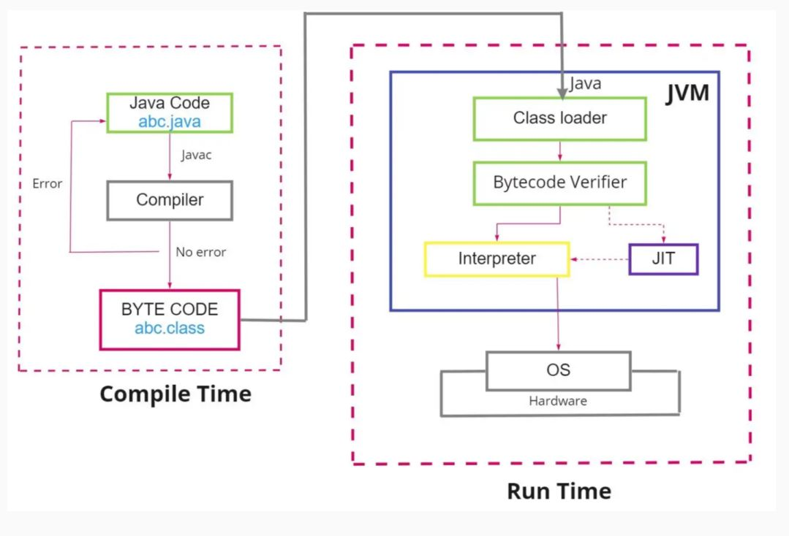

# <center> Compiler Basic

<p align="center">

</p>

## Compiler big picture
### goals 
**1- Correctness:** generate correct machine codes  
**2- Effectiveness:** optimized machine codes  
**3- Efficiency:** reasonable translation time (< 𝑂($n^3$))

Correctness is crucial. It gets hard to debug a code with a broken compiler.

**Verified compilers:**  
∙ Some compilers have been proven to generate correct code! (X.
Leroy, Formal Certification of a Compiler Back End, POPL ’06)  
∙ Requires formal methods.
## formalization

In compiler design, it's essential to precisely describe the input (source code) and output (machine code) of a compiler.

**Input:** Source code (programming language)  
**Output:** Assembly (machine) code  
Let's see how a programming language is described:  
∙ Tow essential ingredients of a language:  
**1- Syntax:** which strings of symbols are valid expressions in the
language?  
∙ Example (Java syntax): Uses a semicolon (";") to separate two
statements  
**2- Semantics:** what do valid expressions actually mean, or how do
they behave?     
∙ Example (Java semantics): What should be printed?   
```java
int z = 0;
System.out.println("z+1=" + z++);
```


## Describing Programming Language Syntax

Programming languages have two crucial components: syntax and semantics.

### Syntax

Syntax defines which strings of symbols are valid expressions in the language. 
#### Example (C++):
```cpp
int @; // Invalid statement
int z = 0;  // Valid statement
std::cout << "z+1=" << z++ << std::endl;  // Valid statement
```
There are multiple ways to define a syntax such as listing all valid programs but this way leads to so many long valid programs and is not practical, natrual languages are easy to underestand but they are nformal, imprecise, vague, tedious, and repetitive. The best chois right now is using formal languages (and automata):  
***∙ Branch of CS that formalizes the properties of “languages”
over strings and their syntax.***   
**∙ Pros:** Well-documenting what programs a compiler should
accept or reject.   
**∙ Pros:** Developing compiler phases (lexer, parser, code
generation) formally and automatically.

You can see an example below using a BNF grammar:
```ebnf
<Statement>       ::= <AssignmentSt>
                   | <ForST>
                   | '{' <StatementList> '}'
                   | ε

<AssignmentSt>    ::= <Id> '=' <Expr>

<ForST>           ::= 'for' <Id> '=' <Expr> 'to' <Expr> <DoPart>

<DoPart>          ::= 'do' <Statement>

<StatementList>   ::= <Statement> ';' <StatementList>
                   | <Statement>
```

### Semantics

Semantics defines the meaning or behavior of valid expressions. We will discuss this aspect in the next chapters.

## Compilation Steps

Compiling a program involves several steps, and it's crucial to understand the process.

 **Intermediate Representations (IRs):**
   - Compiler uses different program Intermediate Representations.
   - These IRs facilitate necessary program manipulations (analysis, optimization, code generation).


#### Example Compilation Steps in C++:

```cpp
if (b==0) a=b;
```


## Compiler Architecture:
### Compiler Phases


- **Parser:** Responsible for analyzing the syntactic structure of the source code and generating a parse tree or abstract syntax tree (AST).

- **Scanner:** Tokenizes the source code, breaking it down into a sequence of tokens for the parser to analyze. 

- **Type Checker:** Ensures that the types of expressions and statements are consistent and adherent to the language's rules.

- **Code Generators:** Translate the intermediate representation (IR) or AST into machine code or another target language.

- **Error Manager:** Handles and reports errors that occur during the compilation process.


> **Note:** The order of these components may vary depending on the specific compiler design
>
> **Note:** The parser acts as a "driver" in the compiler design, meaning it plays a central role in coordinating the compilation process.
>
> **Note:** It analyzes the syntax of the source code, constructs a hierarchical representation (such as a parse tree), and passes this structure to subsequent stages of the compiler.


### Steps in System Context:


- **Preprocessing:** Expanding macros and collecting program sources.
- **Compilation:** Parsing the preprocessed source code and generating an intermediate representation.
- **Linking:** Joining together object files and resolving external references.
- **Loading:** Mapping virtual addresses to physical address space.

### Unresolved references:

This image illustrates how unresolved references (like function calls to external symbols) are handled during compilation and linking in a typical system:                  

**source code**  
The function abs(int) is declared, not defined — it’s assumed to be defined elsewhere, perhaps in another file or library.

This introduces an unresolved reference during compilation.

**assembly code**   
The compiler translates abs(x) into a call _abs instruction.

Since _abs is not defined in this file, the call is marked as an external symbol.

The call instruction uses a relative address, which can't be resolved yet — it depends on where _abs will be located.

**object code**   
The E8 opcode is the CALL instruction in x86-64, which takes a 4-byte relative offset.

The offset (00 00 00 00) is a placeholder — the actual address is unknown during object code generation.

The linker will fill in the correct offset when _abs is resolved.

> **Note:** The compiler emits a relocation entry for _abs in the object file. The linker later:

> 1. Finds the address of _abs in the linked modules or libraries.

> 2. Calculates the relative offset.

> 3. Fills in the 4-byte placeholder in the call instruction.

### Output of the linker:

 The linker at the end merges all the object codes form all the source codes into one unit as the final program to be loaded into memory.

### Memory layout of programs:


The memory layout of a program is typically divided into distinct segments:

Text/Code Segment: Contains compiled machine code (instructions).

Initialized Data Segment: Stores global and static variables with defined initial values.

BSS (Uninitialized Data Segment): Holds global and static variables without initial values.

Heap: Used for dynamically allocated memory (malloc, new). Grows upward.

Stack: Stores function call frames, local variables, and return addresses. Grows downward.

Command Line Arguments: Placed at the top of memory.

The Static Memory Layout (code, data, BSS) is fixed at compile/link time, while the Dynamic Memory Layout (heap and stack) changes at runtime.
## Compile Passes

**Definition:**
A compile pass is a stage in the compilation process where the source program undergoes transformations specified by its phases, producing intermediate output.

- **Single-pass Compiler:** Scans the complete source code only once. Example: Pascal compiler.
- **Multi-pass Compiler:** Processes the source code multiple times, improving the code pass by pass until the final pass emits the final code.

## Compiler Errors

A good compiler assists the programmer in locating and tracking down errors:

- **Compile-time Errors:** Occur during program compilation.
  - Lexical errors
  - Syntactic errors
  - Semantic errors

- **Run-time Errors:** Occur while the program is running after being successfully compiled.
  - Crashes
  - Logical errors

## Types of Errors in Compilers

Common programming errors can occur at various levels:

1. **Lexical Errors:** Misspellings of identifiers, keywords, or operators.
2. **Syntactic Errors:** Misplaced semicolons, extra or missing braces.
3. **Semantic Errors:** Type mismatches between operators and operands.
4. **Logical Errors:** Incorrect reasoning by the programmer.

## Error Recovery

**Definition:**
Error recovery is a process that takes action against errors to reduce negative effects as much as possible.

Common error-recovery strategies for parser error handling:

1. **Panic-mode**
2. **Phrase-level**
3. **Error-productions**
4. **Global-correction**

## Compiler Types

- **Decompiler:** Translates from a low-level language to a higher-level one.
- **Cross-compiler:** Produces code for a different `CPU` or operating system.
- **Transpiler (Source-to-Source Compiler):** Translates between `high-level` languages.
- **Bootstrap Compiler:** Temporary compiler used for compiling a more permanent or better-optimized compiler.
- **Compiler-compiler:** Produces a compiler (or part of one) in a generic and reusable way (e.g., `ANTLR`, `FLEX`, `YACC`, `BISON`).


#### **reminder Interpreter**

An interpreter is another computer program like compiler that executes instructions written in a programming language immediately statement by statement.


## Just-In-Time (JIT) Compilation

### Definition

The JIT compiler, or dynamic translator, reads bytecodes (in a bytecode-compiled system) in many sections (or in full, rarely) and compiles them dynamically into machine code.

- This can be done per-file, per-function, or even on any arbitrary code fragment.
- As a result, the program can run faster.
- Provides lazy/late compiling.
- The code can be compiled when it is about to be executed and then cached and reused later without needing to be recompiled.

### Advantages of JIT Compilation

1. **Improved Performance:**
   - JIT compilation can result in faster execution of the program since machine code is generated dynamically.

2. **Lazy Compilation:**
   - Compilation is deferred until the code is about to be executed. This allows for better optimization decisions based on runtime information.

3. **Caching and Reuse:**
   - Once code is compiled, it can be cached and reused in subsequent executions, reducing the need for repeated compilation.

4. **Adaptability:**
   - JIT compilation allows for adaptability to the runtime environment, optimizing the code based on the specific characteristics of the executing system.





Just-In-Time (JIT) compilation is a technique employed in the field of compiler design to enhance the runtime performance of programs. Unlike traditional ahead-of-time (AOT) compilation, where source code is translated into machine code before execution, JIT compilation occurs dynamically during program execution. This approach combines elements of interpretation and compilation, seeking to leverage the advantages of both.

In JIT compilation, the source code is initially translated into an intermediate representation, often referred to as bytecode or an intermediate language. This intermediate code is not directly executed by the hardware but is designed to be more portable and platform-independent than the original source code.

During runtime, as the program is executed, the JIT compiler analyzes the intermediate code and translates it into machine code that is specific to the underlying hardware architecture. This process occurs on-the-fly, just before the corresponding code is executed, hence the term "just-in-time." The generated machine code is then executed directly by the hardware, resulting in potentially improved performance compared to interpreting the original source or intermediate code.


### Use Cases

- **Bytecode-Compiled Systems:**
  - Commonly used in virtual machines that execute bytecode, such as Java Virtual Machine (JVM) or Common Language Runtime (CLR) in .NET.

- **Execution Speed Optimization:**
  - JIT compilation is employed to improve the execution speed of programs, especially in environments where interpretation of high-level code would be too slow.

- **Memory Efficiency:**
  - By compiling only the necessary portions of code during runtime, JIT compilation can contribute to more efficient memory usage.


# <center> Bootstrapping


**Definition:**
Bootstrapping is a technique where a simple program initiates a more complex system of programs. In the context of compilers, it often involves the process of writing a compiler for a programming language using another compiler written in the same language. This self-compiling process allows for the creation of more sophisticated compilers.

**Example:**
Consider the BIOS (Basic Input/Output System), which initializes and tests hardware, peripherals, and external memory devices when a computer boots. In compiler design, bootstrapping might involve writing a compiler for a language `A` using a compiler written in the same language `A`.

### T-Diagrams:

**Definition:**
T-diagrams are a graphical notation used to represent the relationships between different programming languages in the context of compiler design. The notation takes the form of `A ---(C)---> B`, where a compiler written in language `C` processes source code in language `A` and produces executable code in language `B`.

### Full Bootstrapping:

**Goal:**
The goal of full bootstrapping is to implement a compiler for language `X` on a machine `M`, given the presence of a language `C` compiler/assembler on the same machine.


**Steps:**

1. **Write Compiler for Subset `X` in `C`:**
   - Begin by writing a compiler for a small part (subset) of language `X` using the language `C`. Compile this on machine `M`, where the `C` compiler already exists.


2. **Compile Compiler for Sub `X`:**
   - Use the existing language `C` compiler to compile the compiler written in **Step 1**. This creates a compiler that can process the subset language `Sub X`.


3. **Translate Subset Compiler (Sub X):**
   - Translate the subset compiler (Sub X) written in **Step 1** into the subset language (Sub X). This is a necessary step in the process.


4. **Compile Subset Compiler (Sub X):**
   - Compile the subset compiler (Sub X) from **Step 3** using the compiler built in **Step 2**. This further refines the compiler for `Sub X`.


5. **Extend Subset Language (Sub X):**
   - Extend the subset language (Sub X) compiler from **Step 3** into a compiler for the full language `X`. Importantly, this step is still performed using only the subset language `Sub X`.


6. **Compile Full Language Compiler:**
   - Finally, compile the full language `X` compiler using the compiler built in **Step 4**. At this point, you have a compiler for the full language `X` implemented on machine `M`.


This comprehensive process demonstrates the self-sustaining nature of bootstrapping, where each step builds upon the capabilities of the previous one, ultimately leading to the creation of a compiler for a more complex language.


### Simple Bootstrapping:

**Process:**
If a compiler or interpreter already exists for the language `A` on the target machine `M`, the process of bootstrapping is simplified.


