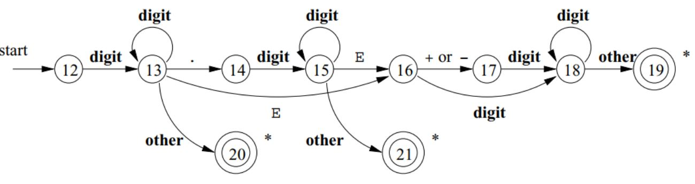

# <center> Lexical Analysis  

<p align="center">

</p>


### Lexical Analysis Goal

**Goal:** The primary objective of lexical analysis is to partition an input string into meaningful elements called tokens.

**Tasks of Lexical Analyzer:**
1. Recognize substrings corresponding to tokens.
2. Return tokens with their categories.

**Main Tasks:**
- Read input characters of the source program.
- Group them into lexemes.
- Produce, as output, a sequence of tokens for each lexeme in the source program.

**Output:**
- The output of lexical analysis is a stream of tokens, which serves as the input to the parser.

### Formal Languages

**Definition:**
- A language over $ Σ $ is a subset of $ Σ* $ (set of all words over $ Σ $ ).
- Alphabet $ Σ: A $ finite set of elements.
- For the lexer: Characters.
- For the parser: Token classes/symbol types.
- Words (strings): Sequences of elements from the alphabet Σ.
- Example: If $ Σ = \{𝑎, 𝑏\} $, then $ Σ* = \{\epsilon, 𝑎, 𝑏, 𝑎𝑎, 𝑎𝑏, 𝑏𝑎, 𝑏𝑏, 𝑎𝑎𝑎, 𝑎𝑎𝑏, 𝑎𝑏𝑎, ...\} $
- Example of an infinite language over $Σ: 𝐿1 = \{𝑎𝑏, 𝑎𝑏𝑎𝑏, 𝑎𝑏𝑎𝑏𝑎𝑏, ...\} = \{{(𝑎𝑏)}^𝑛 | 𝑛 ≥ 1\} $
#### Basic operations on formal languages
# <center>

### Formal Languages Description Notations

1. **Sets:** $ 𝐿1 = \{ {}𝑎^{𝑛} 𝑏 | 𝑛 ≥ 0 \} $
2. **Grammars:** `<𝐴> ::= 𝑎𝐴 | 𝑏`
3. **Automata:**


<!-- <!-- # <center> -->
# <center> 


4. **Regular Expressions (Regex):** Used only for regular languages.
   - Example: 𝑎*

### Formal Grammars

**Definition:**
- 𝐺 = {𝑁, Σ, 𝑃, 𝑆}, where
  - 𝑁: A finite set 𝑁 of nonterminal symbols, disjoint from the strings formed from 𝐺.
  - Σ: A finite set of terminal symbols, disjoint from 𝑁.
  - 𝑃: A finite set 𝑃 of production rules, each rule of the form 𝛼 → 𝛽.
  - 𝑆: A distinguished symbol 𝑆 ∈ 𝑁, the start symbol.

**Convention:**
- Use small letters for terminals and capital letters for non-terminals or variables when writing grammar production rules.

### Regular Grammars

**Definition:**
- A grammar 𝐺 = (𝑁, Σ, 𝑃, 𝑆) is right-linear if all productions are of the form:
  - 𝐴 → 𝑥𝐵 | 𝑥 | 𝜖, where 𝐴, 𝐵 ∈ 𝑁 and 𝑥 ∈ Σ*

**Definition:**
- A grammar is left-linear if all productions are of the form:
  - 𝐴 → 𝐵𝑥 | 𝑥 | 𝜖, where 𝐴, 𝐵 ∈ 𝑁 and 𝑥 ∈ Σ*

**Regular Grammar:**
- A regular grammar is one that is either right-linear or left-linear. 

### Deterministic Finite Acceptor (DFA)

**Definition:**
A deterministic finite acceptor or `DFA` is defined by the quintuple
$$ [ M = (Q, \Sigma, \delta, q_0, F) ] $$
where
- $( Q )$ is a finite set of internal states,
- $( \Sigma )$ is a finite set of symbols called the input alphabet,
- $( \delta: Q \times \Sigma \rightarrow Q )$ is a total function called the transition function,
- $( q_0 \in Q )$ is the initial state,
- $( F \subseteq Q )$ is a set of final states.

### Non-deterministic Finite Acceptor (NFA)

**Definition:**
A non-deterministic finite acceptor or `NFA` is defined by the quintuple
$$ [ M = (Q, \Sigma, \delta, q_0, F) ] $$
where
- $( Q )$ is a finite set of internal states,
- $( \Sigma )$ is a finite set of symbols called the input alphabet,
- $( \delta: Q \times (\Sigma \cup \{\varepsilon\}) \rightarrow 2^Q )$ is a total function called the transition function,
- $( q_0 \in Q )$ is the initial state,
- $( F \subseteq Q )$ is a set of final states.

### NFA vs. DFA

**DFA Transition Function:** $( \delta: Q \times \Sigma \rightarrow Q )$

**NFA Transition Function:** $( \delta: Q \times (\Sigma \cup \{\varepsilon\}) \rightarrow 2^Q )$

- `NFA` can have multiple transitions for one input in a given state.
- `NFA` can have no transition for an input in a given state.
- `NFA` can make a transition without consuming an input symbol (λ or ε-transition).

# <center> 
### Computations of a DFA

- For each input string, there is exactly one path in a `DFA` (O(n)).
$$ [ L(M) = \{ w \in \Sigma^* : \delta^*(q_0, w) \in F \} ] $$ 

# <center> 
### Computations of an NFA and Language Acceptance

- For an input string, there are multiple possible computation paths in an `NFA` $(O(2^n))$.
$$[ L(M) = \{ w \in \Sigma^* : \delta^*(q_0, w) \cap F = \emptyset \} ] $$
# <center> 
### NFA vs. DFA Implementation

- `DFA`s are generally simpler to implement due to their deterministic nature.
 # <center> 
- `NFA`s may require additional mechanisms to handle non-deterministic transitions.
- Simulation of `NFA` requires tracking multiple possible states simultaneously.
 # <center> 

**example:** Construct NFA that accepts all strings of the form $0^k$ where 𝑘 is a multiple of 2 or 3.

**solution:**  
Step 1: Understand the Language
We are working with strings made only of 0s, and we want to accept them if:

k mod 2 = 0 or
k mod 3 = 0  
Accept: 00, 000, 0000, 000000, ...

Step 2: Use Modulo Arithmetic
We know that:

Multiples of 2 mean the number of 0s is even.

Multiples of 3 mean the number of 0s is divisible by 3.

So we can build two machines:

One that accepts if k % 2 == 0

One that accepts if k % 3 == 0

Then, combine both machines using ε-transitions to form a union.

Step 3: Design NFA for Multiples of 2
We build a 2-state loop:

That means:

Every 2 zeros, we return to the accepting state.

Accepts: 00, 0000, 000000, ...  
Step 4: Design NFA for Multiples of 3

That means:

Every 3 zeros, we return to the accepting state.

Accepts: 000, 000000, 000000000, ... 

Step 5: Add a Start State and Combine with ε-transitions
We introduce a new start state (state 0), and:

Add ε-transition to state 1 (begin the multiple-of-2 path)

Add ε-transition to state 3 (begin the multiple-of-3 path)

That allows the NFA to nondeterministically choose either path.

# <center> 
# <center> Regular expressions
Regular expressions are just a notation for some particular
operations on languages.
# <center> 
# <center>
∙ Regular expressions are used to describe a regular languge
(pattern) for a computing machine.   
∙ Extended Regular-Expression Notation: A number of
additional operators may appear as shorthands in regular
expressions, to make it easier to express patterns (will be
discussed later).

# <center> Manual Construction of Lexers

#### Recognition of Tokens

The manual construction of a lexical analyzer involves several steps:

1. **Describe Lexical Patterns:**
   - Define regular expressions (RE) to describe the lexical pattern of each token type.

2. **Construct NFAs:**
   - Create Non-deterministic Finite Automata (NFAs) for each regular expression.

3. **Convert NFAs to DFAs:**
   - Convert the NFAs to Deterministic Finite Automata (DFAs) for efficiency.

4. **Minimize DFA States:**
   - Minimize the number of states in the DFAs where possible.

5. **Construct Transition Diagrams:**
   - Build lexical analyzer transition diagrams from the DFAs.

6. **Implement Transition Diagrams:**
   - Translate the transition diagrams into actual code for the lexical analyzer.
#### Most common tokens
# <center>

#### Transition Diagrams: Notations

As an intermediate step, patterns are converted into stylized flowcharts called "transition diagrams." These diagrams incorporate DFAs for recognizing tokens. If it's necessary to retract the forward pointer one position (i.e., the lexeme doesn't include the symbol that got us to the accepting state), a '*' is placed near that accepting state.

To create a transition diagram for a lexical analyzer from regular-expression patterns, follow these steps:

**1. Define States:** Represent each state as a node (circle) that summarizes the condition of the input scanned so far, tracking characters between the lexemeBegin and forward pointers.  
**2. Add Edges:** Draw directed edges between states, labeled with a symbol or set of symbols. Each edge indicates a transition from one state to another based on the next input symbol. Ensure the diagram is deterministic (at most one edge per symbol from any state).  
**3. Designate Start State:** Mark one state as the start state with an incoming edge labeled "start." This is where scanning begins before any input is read.  
**4. Identify Accepting States:** Mark states that indicate a lexeme has been found with a double circle. These are final states where a token and optional attribute value may be returned to the parser.  
**5. Handle Retraction (if needed):** If the forward pointer needs to retract one position (i.e., the lexeme excludes the last symbol), place a * near the accepting state.  
**6. Attach Actions:** Associate any required actions (e.g., returning a token) with accepting states.
The resulting diagram visually represents the process of scanning input to match patterns, guiding the lexical analyzer to recognize tokens deterministically.

#### Transition Diagram Examples:

1. **Relational Operations (RELOPs):**
   - Diagram for recognizing relational operators like `<`, `<>`, `=`, `>=`, `<=`, `==`, etc.


2. **Reserved Words and Identifiers:**
   - Diagram for recognizing reserved words and identifiers in the source code.


3. **Unsigned Numbers:**
   - Diagram for recognizing unsigned numerical values.



``` cpp
TOKEN getRelop()
{
   TOKEN retToken = new(RELOP);
   while(1) { /* repeat character processing until a returnor failure occurs */
      switch(state) {
         case 0: c = nextChar();
         if ( c == '<' ) state = 1;
         else if ( c == '=' ) state = 5;
         else if ( c == '>' ) state = 6;
         else fail(); /* lexeme is not a relop */
         break;
         case 1: ...
         ...
         case 8: retract();
         retToken.attribute = GT;
         return(retToken);
      }
   }
}
```
Here we show the action for state 8. Because state 8 bears a *, we must retract the input pointer one position (i.e., put c back on the input
stream). That task is accomplished by the function retract(). Since state 8represents the recognition of lexeme >, we set the second component of the
returned ob ject, which we suppose is named attribute, to GT, the code for
this operator.

#### Lexer Input and Output:

The lexical analyzer takes the source code as input and produces a stream of tokens as output. This token stream is then passed to the parser for further syntactic analysis.


#### Static Scope and Block Structure:

- The scope of a declaration is implicitly determined by where it appears in the program.
- Code blocks group declarations and statements, often delimited by braces `{}` or keywords like `begin` and `end`.


#### Static scope and block structure in C++


#### White Spaces:

- Whitespaces are defined as tokens using ***space characters*** (' '), ***tabs*** ('\t), and ***end-of-line characters*** ('\r', '\n').
- In most languages, whitespaces and comments can occur between any two tokens and are generally ignored by the parser.

#### Comments:

- Comments are detected and discarded by the lexer.
- They can be single-line or multi-line.
- Lexical analyzers always find the next non-whitespace, non-comment token.  

**example:**
Design a transition diagram to identify multi-line comments in
Java (C++) programs.
``` cpp
/* This is a
* multi-line comments */
```
**solution:**  
**S0 (Start State):** Initial state.
Transition on / to S1.  
**S1:** Seen /, expecting * to start the comment.
Transition on * to S2.
Transition on any other character (not *) back to S0 (or a failure state, not shown for simplicity).   
**S2:** Inside the comment, after seeing /*.
Transition on * to S3 (potential end of comment).
Transition on any other character (including newlines) back to S2 (stay in comment).  
**S3:** Seen * inside comment, checking for / to end.
Transition on / to S4 (accepting state, comment complete).
Transition on any other character (including *) back to S2 (continue comment).      
**S4 (Accepting State):** Comment complete (seen */).
Double circle, no retraction needed (lexeme includes */).
Action: Return token (e.g., COMMENT) to the parser. 

# <center>
#### Lexical Errors and Error Recovery:

- Lexical errors occur when no token pattern matches the remaining input.
- A "panic mode" recovery strategy involves deleting characters until a well-formed token is found.
- Other recovery actions include deleting, inserting, replacing, or transposing characters.


##### **Panic Mode Recovery**

Panic mode recovery is one of the error recovery strategies used in compiler design. It is commonly used by most parsing methods. In this strategy, when an error is discovered, the parser discards input symbols one at a time until it finds a designated set of synchronizing tokens. These tokens are delimiters such as semicolons or ends, which indicate the end of an input statement.

Here is a simple example of how panic mode recovery works:

```cpp
int a, 5abcd, sum, $2;

```

In this case, the parser would discard the input symbols one at a time until it finds a synchronizing token (like a semicolon). However, this strategy may lead to semantic or runtime errors in further stages.
The panic mode recovery process can be implemented in a high-level parsing function. This function is responsible for detecting parsing errors and re-synchronizing the input stream by skipping tokens until a suitable spot to resume parsing is found. For a grammar that ends statements with semicolons, the semicolon becomes the synchronizing token.
Here is an example of a top-level parsing function that uses panic mode recovery:

```cpp
static int doParsing(void){
  initialize errorcounter to zero

  WHILE TYPEOFTOKEN is not EOF DO
     SWITCH TYPEOFTOKEN
     CASE ID:       -- ID is in the FIRST set of assignment()
        returnStatus = assignment()
        break
     CASE PRINT:    -- PRINT is in the FIRST set of print()
        returnStatus = print()
        break
     CASE ...
         -- Other cases can go here, for other statement types
         break
     DEFAULT:
        eprintf("File %s Line %ld: Expecting %s or %s;"
           " found: %s '%s'",
              filename,
              LINENUMBER,
              tokenType(ID),
              tokenType(PRINT),
              tokenType(TYPEOFTOKEN),
              LEXEMESTR );
        returnStatus = FALSE
        break
     END SWITCH

     IF returnStatus is FALSE THEN
        CALL panic()
        increment errorcounter
     ENDIF
  END WHILE
  return errorcounter
}

```

In this example, each parsing function is a Boolean function. Each parsing function may succeed, in which case we continue parsing, or fail, in which case we stop parsing and return the failure indication to our parent function.


#### Lexical Analysis Challenges:

∙ In Fortran, whitespace is insignificant:       
∙ VAR1 is exactly the same as VA R1.  
∙ Philosophy: removing all the whitespace should not change the
meaning of the program. :-D   
∙ How does it make the task of scanner difficult?  
∙ DO 5 I = 1,25 Here DO is a keyword representing a loop.  
∙ DO 5 I = 1.25 Here DO5I is a variable assigned an
integer (there is no loop).
#### Lookahead:

Lookahead is required to decide where one token ends and the
next token begins. We would like to minimize lookahead.  
∙ Lookahead is always required, e.g., we need lookahead to
disambiguate between == and =.   
∙ PL/1: keywords are not reserved.  
∙ IF ELSE THEN THEN = ELSE; ELSE ELSE = THEN  
∙ This makes lexical analysis a bit more difficult – need to decide
what is a variable name and what is a keyword, and so need to
look at what’s going on in the rest of the expression.  
∙ There are examples where PL/1 may require unbounded
lookahead!

# <center> Automatic construction of Lexers

#### Lexer Construction Steps

**Input: Token Specifications**
- A list of regular expressions (RE) in priority order that define the patterns of tokens in a programming language.

**Output: Lexer**
- A program that reads an input stream and breaks it up into tokens based on the specified regular expressions.

**Algorithm:**

1. **Convert REs into NFAs:**
   - Transform regular expressions into Non-deterministic Finite Automata (NFAs).
   - Each regular expression corresponds to an NFA that recognizes the language defined by that expression.

2. **Convert NFAs to DFA:**
   - Convert NFAs to Deterministic Finite Automata (DFAs) for efficiency.
   - Create a DFA that accepts the same language as the original NFA.

3. **Convert DFA into Transition Table:**
   - Create a transition table that represents the DFA.
   - The table indicates the next state for each combination of current state and input symbol.

#### The Lex/Flex Tool

Flex, also known as Fast Lexical Analyzer Generator, is a tool used for generating lexical analyzers, also known as "scanners" or "lexers". It was written in C around 1987 by Vern Paxson and is often used in conjunction with other tools like Berkeley Yacc parser generator or GNU Bison parser generator.

## Structure of Lex Programs

The structure of a lex program is as follows:

```python

declarations
%%
translation rules
%%
auxiliary functions
```

- **Manifest constants**: These are enclosed in `{}` brackets and can include definitions for variables, regular definitions, and manifest constants.

- **Declarations**: These are the variable declarations that are used in the program.

- **Translation rules**: Each rule has the form: `Pattern { Action }`. Patterns are regular expressions, and actions are code fragments, typically in C.

- **Auxiliary functions**: These are additional functions that can be compiled separately and loaded with the lexical analyzer.

## Lexical Analysis

Lexical analysis, or lexing, is the process of converting a sequence of characters into a sequence of tokens. The lexical analyzer takes in a stream of input characters and returns a stream of tokens.

## Running a Lex Program

To run a lex program, you need to follow these steps:

1. Write an input file that describes the lexical analyzer to be generated. This file should be named `lex.l` and written in the lex language. The lex compiler transforms `lex.l` into a C program, in a file that is always named `lex.yy.c`.

2. Compile the `lex.yy.c` file into an executable file. This can be done using the C compiler.

3. Run the executable file. The output file will take a stream of input characters and produce a stream of tokens.

Here is an example of how to run a lex program:

```bash
flex filename.l # or flex filename.lex depending on the extension file is saved with
gcc lex.yy.c
./a.out
```

Then provide the input to the program if it is required. Press `Ctrl+D` or use some rule to stop taking inputs from the user.

## Advantages and Disadvantages of Flex

Flex has several advantages:

- **Efficiency**: Flex-generated lexical analyzers are very fast and efficient, which can improve the overall performance of the programming language.
- **Portability**: Flex is available on many different platforms, making it easy to use on a wide range of systems.
- **Flexibility**: Flex is very flexible and can be customized to support many different types of programming languages and input formats.
- **Easy to Use**: Flex is relatively easy to learn and use, especially for programmers with experience in regular expressions.

However, there are also some disadvantages:

- **Steep Learning Curve**: While Flex is relatively easy to use, it can have a steep learning curve for programmers who are not familiar with regular expressions.
- **Limited Error Detection**: Flex-generated lexical analyzers can only detect certain types of errors, such as syntax errors and misspelled keywords.
- **Limited Support for Unicode**: Flex has limited support for Unicode, which can make it difficult to work with non-ASCII characters.
- **Code Maintenance**: Flex-generated code can be difficult to maintain over time, especially as the programming language evolves and changes. This can make it challenging to keep the lexical analyzer up to date with the latest version of the language.


#### Lex Architecture

- Describes how Lex works in terms of token recognition.
- Lex takes a set of regular expressions and corresponding actions to create a lexer.


**How does lex work?**


Flex (a tool for generating lexical analyzers) works by converting a token specification into a deterministic finite automaton (DFA) to recognize patterns in input text and perform corresponding actions. Here's how it operates:

**1. Token Specification:** The input to Flex includes a set of patterns (regular expressions) and associated actions. In the image, the token specification defines:
ab → {Action 1}
aab → {Action 2}
a+ (one or more as) → {Action 3}  
**2. NFA Construction:** Flex initially constructs a nondeterministic finite automaton (NFA) from the regular expressions. The NFA (left diagram) includes states (e.g., q0 to q9) with ε-transitions (no input) and labeled transitions (e.g., a, b). Multiple paths (e.g., from q0 to q3 via ε and a, or to q7 via b) allow non-deterministic choices.  
**3. Conversion to DFA:** The NFA is converted into a DFA (right diagram) to ensure determinism, where each state (e.g., s0 to s4) has at most one transition per input symbol (a or b). The DFA includes:
Start state s0.
Accepting states (e.g., s2 for aab).
A trap state to handle invalid inputs.
Transitions based on the input alphabet Σ = {a, b}, as shown in the transition table.  
**4. Transition Table:** The table defines state transitions:
s0 → s1 on a, error on b.
s1 → s3 on a, s2 on b.
s2, s3, s4 lead to errors or self-loops (e.g., s4 → s4 on a).
This guides the DFA through the input string.   
**5 .Input Processing:** For an input like aab:
Start at s0 → s1 (on a) → s3 (on a) → s2 (on b).
s2 is an accepting state, triggering {Action 2} for aab.  
**6. Action Execution:** When the DFA reaches an accepting state matching the longest prefix of the input (e.g., aab over ab), Flex executes the corresponding action (e.g., returning a token to the parser).
Flex automates this process, generating C code for a lexical analyzer that uses the DFA to scan input, match patterns, and execute actions efficiently.  
The algorithm for each part is described in the following sections.
#### Regular Expression to NFA

- Illustrates the process of converting a regular expression to a Non-deterministic Finite Automaton (NFA).
- Each construct in the regular expression corresponds to a state transition in the NFA.


##### Regular Expressions (RE):

A regular expression is a concise way to describe a set of strings. It consists of:
- **Alphabet:** A set of symbols (characters).
- **Operators:** Specify operations to combine and manipulate sets of strings.
- **Special Symbols:** Representing operations like concatenation, union, and closure.

##### Nondeterministic Finite Automaton (NFA):

An NFA is a type of finite automaton that allows multiple transitions from a state on a given input symbol. It has states, transitions, and an initial and final state.

##### Steps to Convert RE to NFA:

1. **Base Cases:**

   - **Empty String (𝜖):** Create an NFA with two states (initial and final) and an 𝜖 transition between them.
   - **Single Symbol (a):** Create an NFA with two states, one initial and one final, with a transition labeled by the symbol.


2. **Concatenation (AB):**
   - If RE is AB, create NFAs for A and B.
   - Connect the final state of A to the initial state of B.

3. **Union (A | B):**
   - If RE is A | B, create NFAs for A and B.
   - Create a new initial state with 𝜖 transitions to the initial states of A and B.
   - Create a new final state with 𝜖 transitions from the final states of A and B.


4. **Kleene Closure ($A^*$):** 


   - If RE is A*, create an NFA for A.
   - Add a new initial state with 𝜖 transitions to the initial state of A and a 𝜖 transition from the final state of A to the initial state of A.

##### Example:

Let's convert the regular expression `(a|b)*abb` to an NFA:

1. **Base Cases:**
   - `a`: NFA1 (States: 2, Initial: 1, Final: 2, Transition: 1->2 (a))
   - `b`: NFA2 (States: 2, Initial: 1, Final: 2, Transition: 1->2 (b))
   - 𝜖: NFA𝜖 (States: 2, Initial: 1, Final: 2, Transition: 1->2 (𝜖))

2. **Concatenation (ab):**
   - Concatenate NFA1 and NFA2.

3. **Union (a|b):**
   - Create a new initial state with 𝜖 transitions to the initial states of NFA1 and NFA2.
   - Create a new final state with 𝜖 transitions from the final states of NFA1 and NFA2.

4. **Kleene Closure ((a|b)*):**
   - Add a new initial state with 𝜖 transitions to the initial state of the union NFA.
   - Add a 𝜖 transition from the final state of the union NFA to its initial state.

5. **Concatenation with `abb`:**
   - Concatenate the Kleene Closure NFA with the NFA for `abb`.

The resulting NFA accepts the language described by the regular expression.


#### Converting NFA to DFA
- For every NFA there exists an equivalent DFA that accepts the
same set of strings.
- Demonstrates the algorithm to convert NFAs to DFAs.
- Each set of possible states in the NFA becomes one state in the DFA, resulting in a more efficient representation.
<!--  -->
<div>
  
  <video id="gifVideo" width="300" controls style="display:block;">
    <source id="gifSource" src="pictures/nfa-to-dfa.gif" type="video/gif">
  </video>
  <button onclick="togglePlay()">Toggle Play/Pause</button>
</div>

<script>
  const video = document.getElementById('gifVideo');
  const source = document.getElementById('gifSource');
  let isPlaying = false;

  function togglePlay() {
    if (isPlaying) {
      video.pause();
      isPlaying = false;
    } else {
      video.play();
      isPlaying = true;
    }
  }

  // Pause at the last frame
  video.addEventListener('ended', () => {
    video.pause();
    isPlaying = false;
  });
</script>
**Algorithm:**
1. Keep track of a set of all possible states in which the
automaton could be,
2. View this finite set as one state of new automaton,
3. When processing if we see a set exactly the same as a set
constructed earlier we mark it.


### DFA Minimization

DFA minimization is the process of converting a given Deterministic Finite Automaton (DFA) to an equivalent DFA with the minimum number of states. This process is also known as the optimization of DFA and uses a partitioning algorithm.

The steps to minimize a DFA are as follows:

1. **Partitioning**: Divide the set of states (Q) into two sets. One set will contain all final states and the other set will contain non-final states. This partition is called P0.

2. **Initialization**: Initialize k = 1.

3. **Finding Pk**: Find Pk by partitioning the different sets of Pk-1. In each set of Pk-1, take all possible pairs of states. If two states of a set are distinguishable, split the sets into different sets in Pk.

4. **Stopping Condition**: Stop when Pk = Pk-1 (No change in partition).

5. **Merging States**: All states of one set are merged into one. The number of states in the minimized DFA will be equal to the number of sets in Pk.

Two states (qi, qj) are distinguishable in partition Pk if for any input symbol a, δ(qi, a) and δ(qj, a) are in different sets in partition Pk-1.

Here's a pseudocode example of Hopcroft's algorithm, one of the algorithms for DFA minimization:

```
P := {F, Q \ F}
W := {F, Q \ F}
while (W is not empty) do
   choose and remove a set A from W
   for each c in Σ do
       let X be the set of states for which a transition on c leads to a state in A
       for each set Y in P for which X ∩ Y is nonempty and Y \ X is nonempty do
           replace Y in P by the two sets X ∩ Y and Y \ X
           if Y is in W
               replace Y in W by the same two sets
           else
               if |X ∩ Y| <= |Y \ X|
                  add X ∩ Y to W
               else
                  add Y \ X to W
```

This algorithm starts with a partition that is too coarse: every pair of states that are equivalent according to the Nerode congruence belong to the same set in the partition, but pairs that are inequivalent might also belong to the same set. It gradually refines the partition into a larger number of smaller sets, at each step splitting sets of states into pairs of subsets that are necessarily inequivalent.

Advantages of DFA minimization include reduced complexity, optimal space utilization, improved performance, and language equivalence. However, it also has some disadvantages such as increased computational complexity, additional design and analysis effort, loss of readability, and it's limited to deterministic automata.


**In Sammary:**
**Intuition:**
- Two DFA states are equivalent if all subsequent behavior from those states is the same.

**Procedure:**
1. Create a table of state pairs.
2. Mark cells where one state is final and the other is non-final.
3. Mark pairs where transitions on the same symbol lead to marked pairs.
4. Repeat step 3 until no unmarked pairs remain.
5. Merge unmarked states to achieve a minimized DFA.

#### Resolving Ambiguities in Lexers

**Regular Expression Ambiguity:**
- Ambiguity arises when regular expressions can match input in multiple ways.

**Conflict Resolution in Lex:**
1. **Longest/Maximal Match Rule:**
   - Prefer a longer prefix over a shorter one.
2. **Declaration Priority:**
   - If the longest prefix matches multiple patterns, prefer the one listed first in the Lex program.

#### The Flex Manual

- An essential reference for using the Flex tool.
- It provides detailed information on the Flex tool and its capabilities.
- Refer to the provided appendix slide for in-depth insights.


