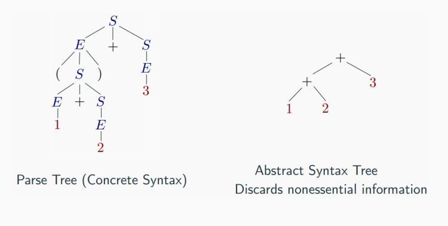
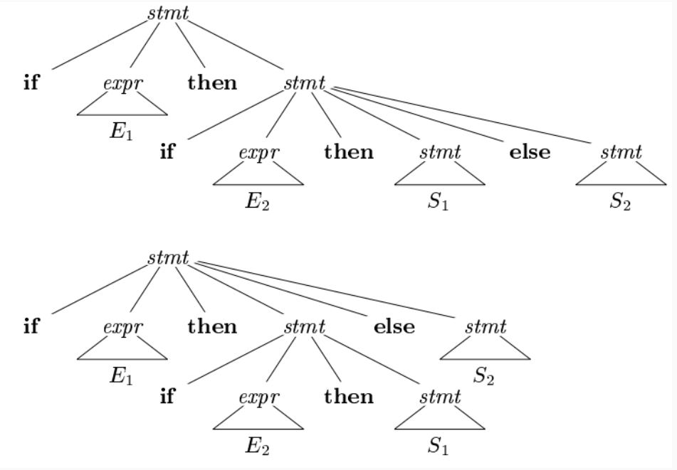

# <center> Syntax Analysis


When an input string (source code or a program in some language) is given to a compiler, the compiler processes it in several phases, starting from `lexical analysis` (As mentioned scans the input and divides it into tokens) to target code generation.


`Syntax analysis` or `parsing` constitutes the ***second*** phase within the compiler's workflow. This chapter delves into fundamental concepts crucial for constructing a parser.

As previously explored, a `lexical analyzer` proficiently identifies tokens using regular expressions and pattern rules. However, its capacity is constrained when it comes to scrutinizing the syntax of a given sentence, particularly in tasks involving balancing tokens like parentheses. To overcome this limitation, `syntax analysis` employs `context-free grammar` **(CFG)**, a construct recognized by push-down automata.

`Syntax Analysis`, situated after the `lexical analysis`, scrutinizes the syntactical structure of the input. It verifies whether the provided input adheres to the correct syntax of the relevant programming language. This verification process involves constructing a data structure known as a `Parse tree` or `Syntax tree`. By leveraging the predefined Grammar of the language and the input string, the parse tree is crafted. Successful derivation of the input string from this syntax tree indicates correct syntax usage. Conversely, any deviation triggers an error report from the syntax analyzer.

`Syntax analysis`, often referred to as `parsing`, is a critical phase in compiler design where the compiler assesses whether the source code aligns with the grammatical rules of the programming language. Typically occurring as the second stage in the compilation process, following `lexical analysis`, the primary objective is to generate a parse tree or `abstract syntax tree` ***(AST)***. This hierarchical representation mirrors the grammatical structure of the program encapsulated in the source code.


So, let's to Learn...


CFG, on the other hand, is a superset of Regular Grammar, as depicted below:


> which are fully explained in the next lesson

## Syntax Analyzers

A syntax analyzer, also known as a parser, receives input in the form of token streams from a lexical analyzer. Its primary role is to examine the source code (presented as a token stream) against production rules, aiming to identify and flag any errors within the code. The outcome of this process is the creation of a parse tree.

In essence, the parser performs two essential tasks: 
1. parsing the code to detect errors
2. generating a parse tree as the result of this analysis.

It's important to note that parsers are designed to handle the `entire code`, <u>even in the presence of errors</u>. To achieve this, parsers employ error recovery strategies, which we will delve into later in this chapter. These strategies enable parsers to effectively navigate and process code, providing a comprehensive analysis and aiding in the identification and handling of errors within a program.


### Let's Dive into Derivations!

In the world of compiler design, there are two types of derivations that we often encounter: left-most and right-most derivations. These are like the two sides of a coin, each with its own unique characteristics. 

**Production Rules**

Let's start with some production rules. These are like the recipes that our compiler follows to understand and process the input string. Here are some example production rules:

```Algorithm
E → E + E
E → E * E
E → id 
```

And here's the input string that we'll be working with: `id + id * id`

**Left-most Derivation**

Now, let's see how the compiler would process this input string using a left-most derivation. This is like saying, "Hey compiler, let's start from the left and work our way to the right." Here's how it looks:

```Algorithm
E → E * E
E → E + E * E
E → id + E * E
E → id + id * E
E → id + id * id
```

Notice that the left-most non-terminal is always processed first. It's like the compiler is saying, "I'll handle the leftmost thing first, then move on to the next one on the left."

**Right-most Derivation**

Now, let's see how the compiler would process the same input string using a right-most derivation. This is like saying, "Hey compiler, let's start from the right and work our way to the left." Here's how it looks:

```Algorithm
E → E + E
E → E + E * E
E → E + E * id
E → E + id * id
E → id + id * id
```

And that's it! We've now explored both left-most and right-most derivations. Remember, these are just the two sides of a coin. Depending on the parsing strategy that the compiler uses, it might prefer one side over the other.


### Understanding Parse Trees

Parse trees are like a roadmap for your compiler. They are graphical representations of a derivation, showing how strings are derived from the start symbol. The start symbol becomes the root of the parse tree, and it's great to visualize this process.

Let's take a look at an example using the left-most derivation of `a + b * c`.

**The Left-most Derivation**

For example for write parse tree for this left-most derivation:

```
E → E * E
E → E + E * E
E → id + E * E
E → id + id * E
E → id + id * id
```

**Step-by-Step Parse Tree Construction**

Now, let's build the parse tree step-by-step:


step 1: `E → E * E`


step 2: `E → E + E * E`


step 3: `E → id + E * E`


step 4: `E → id + id * E`


step 5: `E → id + id * id`


**Parse Tree Characteristics**

In a parse tree, we have:

- All leaf nodes are terminals.
- All interior nodes are non-terminals.
- In-order traversal gives the original input string.
- The parse tree shows the associativity and precedence of operators. The deepest sub-tree is traversed first, so the operator in that sub-tree gets precedence over the operator in the parent nodes.

**Ambiguity in Grammar**

A grammar is said to be ambiguous if it has more than one parse tree (left or right derivation) for at least one string. For example, consider the following grammar:

```
E → E + E
E → E – E
E → id
```

For the string `id + id – id`, the above grammar generates two parse trees. The language generated by an ambiguous grammar is said to be inherently ambiguous. While no method can automatically detect and remove ambiguity, it can be manually removed by re-writing the whole grammar without ambiguity, or by setting and following associativity and precedence constraints.


in another word:


Parse trees and derivations are key concepts in compiler design. They help us understand how to process and evaluate expressions.

**Context-Free Grammar and Parse Trees**

A context-free grammar (CFG) is a type of grammar where every production rule is of the form `A → α`, where `A` is a single non-terminal and `α` is a string of terminals and/or non-terminals. 

A parse tree, on the other hand, is a tree structure that represents the syntactic structure of a string according to some grammar. In the context of a CFG, a parse tree is a derivation or parse tree for `G` if and only if it has the following properties:

- The root is labeled `S`.
- Every leaf has a label from `T ∪ {ε}`.
- Every interior vertex (a vertex that is not a leaf) has a label from `V`.
- If a vertex has label `A ∈ V`, and its children are labeled (from left to right) `a1, a2, ..., an`, then `P` must contain a production of the form `A → a1a2...an`.
- A leaf labeled `ε` has no siblings, that is, a vertex with a child labeled `ε` can have no other children.

**Example of Derivation (Parse) Trees**

Consider the following grammar and string:

- Grammar: `E → E + E | E * E | -E | (E) | id`
- String: `-(id + id)`

The leftmost derivation for this grammar and string is:

```
E ⇒ -E ⇒ -(E) ⇒ -(E + E) ⇒ -(id + E) ⇒ -(id + id)
```

The rightmost derivation for the same grammar and string is:

```
E ⇒ -E ⇒ -(E) ⇒ -(E + E) ⇒ -(E + id) ⇒ -(id + id)
```

Both derivations result in the same parse tree.

**Derivation and Parse Trees**

There is a many-to-one relationship between derivations and parse trees. Indeed, no information on the order of derivation steps is associated with the final parse tree.


## Parse trees and abstract syntax tree (AST)
An AST does not include inessential punctuation and delimiters (braces, semicolons, parentheses, etc.).


## Understanding Associativity

Associativity is like a rule that helps us decide the order of operations when an operand has operators on both sides. If the operation is left-associative, the operand will be taken by the left operator. If it's right-associative, the right operator will take the operand. 

**Left Associative Operations**

Operations like Addition, Multiplication, Subtraction, and Division are left associative. This means that when an expression contains more than one of these operations, the operations are performed from left to right. 

For example, if we have an expression like `id op id op id`, it will be evaluated as `(id op id) op id`. To illustrate, consider the expression `(id + id) + id`.

**Right Associative Operations**

Operations like Exponentiation are right associative. This means that when an expression contains more than one of these operations, the operations are performed from right to left. 

For example, if we have an expression like `id op (id op id)`, it will be evaluated as `id op (id op id)`. To illustrate, consider the expression `id ^ (id ^ id)`.

**Important Points**

Here are a few key points to remember about associativity:

- All operators with the same precedence have the same associativity. This is necessary because it helps the compiler decide the order of operations when an expression has two operators of the same precedence.
- The associativity of postfix and prefix operators is different. The associativity of postfix is left to right, while the associativity of prefix is right to left.
- The comma operator has the lowest precedence among all operators. It's important to use it carefully to avoid unexpected results.


## Precedence

Precedence is like a rule that helps us decide which operation to perform first when two different operators share a common operand. For example, in the expression `2+3*4`, both addition and multiplication are operators that share the operand `3`. 

By setting precedence among operators, we can easily decide which operation to perform first. Mathematically, multiplication (*) has precedence over addition (+), so the expression `2+3*4` will always be interpreted as `(2 + (3 * 4))`.

## Left Recursion

Left recursion is a situation where a grammar has a non-terminal that appears as the left-most symbol in its own derivation. This can cause problems for top-down parsers, which start parsing from the start symbol and can get stuck in an infinite loop when they encounter the same non-terminal in their derivation.

For example, consider the following grammar:

1. `A => Aα | β`
2. `S => Aα | β`
  `A => Sd`

The first example is an example of immediate left recursion, where `A` is any non-terminal symbol and `α` represents a string of non-terminals.
The second example is an example of indirect left recursion.


In a top-down parser, it will first parse `A`, which in turn will yield a string consisting of `A` itself and the parser may go into an infinite loop.

By understanding and managing precedence and left recursion, we can make sure that our compiler can correctly parse and evaluate expressions.


## Summary


### Understanding Syntax Analyzers

Syntax analyzers play a crucial role in the field of compiler design. They validate the syntax of the source code written in a programming language using a component called a parser. The aim is to test whether a source code (𝑤) belongs to a programming language (𝐿) with grammar (𝐺). The answer is a simple "yes" or "no". 

However, the syntax analyzer in a compiler must do more than just validate the syntax. It must also generate a syntax tree and handle errors gracefully if the string is not in the language. 

The parser uses the stream of tokens produced by the lexical analyzer to create a tree-like intermediate representation that depicts the grammatical structure of the token stream. The parser also reports any syntax errors in an intelligible fashion and recovers from commonly occurring errors to continue processing the remainder of the program.

### Prerequisites for Syntax Analysis

Syntax analysis requires two main components:

1. An expressive description technique to describe the syntax.
2. An acceptor mechanism to determine if the input token stream satisfies the syntax description.

For lexical analysis, regular expressions are used to describe tokens, and finite automata is used as an acceptor for regular expressions.

### Limitations of Regular Expressions for Syntax Analysis

General-purpose programming languages like C, C++, C#, Java, etc., are not regular languages, so they cannot be described by regular expressions. Consider nested constructs (blocks, expressions, statements), and you'll see that regular expressions fall short. For example, the syntax of the '{' construct in the second code snippet can be described with a language like 𝐿 = {︀𝑎𝑛𝑏𝑛|𝑛 ≥ 0}, which is a context-free language, not regular.

### Non-Context-Free Language Constructs

Not all constructs found in typical programming languages can be specified using Context-Free Grammar (CFG) grammars alone. For instance, the declaration of identifiers before their use and checking that the number of formal parameters in the declaration of a function agrees with the number of actual parameters are examples of constructs that cannot be specified using CFG grammars alone.

### Syntax Analysis Scope

Syntax analysis cannot check whether variables are of types on which operations are allowed, whether a variable has been declared before use, or whether a variable has been initialized. These issues will be handled in the semantic analysis phase. For now, let's focus on syntax analysis.

### Context-Free Grammars for Programming Languages

Programming languages grammar uses Context-Free Grammar (CFG) instead of regular grammar to precisely describe the syntactic properties of the programming languages. A specification of the balanced-parenthesis language using context-free grammar is a good example of this. 

## Example


Unambiguous, with precedence and associativity rules honored:

### Ambiguous:

E -> E + E | E * E | (E) | num | id

### Unambiguous:

E -> E + T | T

T -> T * F | F

F -> (E) | num | id

For another example for operation(+, -, *, /, ^), we have:

E -> E + T | T

T -> T * F | T * F | F

F -> G ^ F | G

G -> num | id | (E)

                         E
                        /|\
                       / | \
                      /  |  \
                     E   +   T
                     |      /|\ 
                     |     / | \
                    num   T  *  F
                     |    |     |
                     1    F     G
                         /|\    |
                        G ^ F  num
                        |   |   | 
                       num  G   3
                        |   |
                        2  num
                            |
                            3


                            
# Types of Grammar

<!--  -->


### 1. Regular Expressions

#### Definition
- **Regular Expressions (Regex):** A regular expression is a sequence of characters that defines a search pattern. It is commonly used for string matching within a text.

#### Example
- The regular expression `(a + b * c)*` describes the language of all strings over the alphabet `{a, b, c}` where any combination of `a`, `b`, and `c` is allowed, including the empty string.

#### Operations on Regular Expressions
- **Concatenation (`r1 r2`):** Combines two regular expressions.
- **Union (`r1 + r2`):** Represents alternatives between two regular expressions.
- **Kleene Star (`r*`):** Denotes zero or more repetitions of the preceding regular expression.

### 2. Recursive Definition

#### Primitive Regular Expressions
- **Empty Set (`∅`):** Represents the language containing no strings.
- **Empty String (`λ`):** Represents the language containing only the empty string.
- **Atomic Symbol (`α`):** Represents a single character from the alphabet.

#### Operations
- **Union (`r1 + r2`):** Represents the union of two languages.
- **Concatenation (`r1 r2`):** Represents the concatenation of two languages.
- **Kleene Star (`r*`):** Represents zero or more repetitions of a language.

### 3. Examples

#### Example 1
- Regular Expression: `(a + b) * a*`
- Language: All strings with any combination of `a` and `b`, followed by zero or more `a`.

#### Example 2
- Regular Expression: `(a + b*) * (c + ∅)`
- Language: All strings with any combination of `a` and zero or more `b`, followed by either `c` or the empty string.

### 4. Languages of Regular Expressions

#### Definition
- For a regular expression `r`, the language `L(r)` is the set of all strings that can be generated by `r`.

#### Example
- For the regular expression `(a + b * c)*`, `L((a + b * c)*)` is the set of all strings over `{a, b, c}`.

### 5. Conversion from Finite Automaton (FA) to Regular Expression

#### Generalized Transition Graph
- Represents the transitions of a finite automaton.
- The final regular expression is obtained by combining the regular expressions associated with the transitions.

#### Example
- Transition graph with states `q0`, `q1`, `q2`, `q3`, `q4`, and transitions labeled with regular expressions.
- The final regular expression `r` is obtained by combining the expressions associated with transitions.


# Ambiguity Problems and Eliminating the Ambiguity

<!--  -->

## Understanding Ambiguity in Compilers

Ambiguity in compilers can lead to significant problems. It occurs when the meaning of a program can be incorrect due to the lack of precision in the language syntax. One classic example of such ambiguity is the "dangling else" problem.

**Dangling Else Problem**

Consider the following statement:

```
if E1 then if E2 then S1 else S2
```

Here, `E1`, `E2`, `S1`, and `S2` represent any expressions or statements. The dangling else problem arises because it's unclear to which `if` statement the `else` clause should be attached. 





**Example**

Let's consider the following values: `E1 = false`, `E2 = true`, `S1 = z := 10`, and `S2 = z := 0`.

- If we parse this statement using the top tree, the `z` variable doesn't get set, which is incorrect.
- If we parse using the bottom tree, `z = 0`, which is also incorrect.

Both trees are valid parse trees for the given statement, leading to ambiguity.

**Resolving Ambiguity**

To resolve this ambiguity, we can use braces `{}` and indentation to clearly indicate the structure of the `if` statements. For example:

```
if E1 {
    if E2 {
        S1
    } else {
        S2
    }
}
```

In this case, it's clear that the `else` clause belongs to the inner `if` statement.

Another solution is to use the `if-else if-else` format, which specifically indicates which `else` belongs to which `if`.

**Note:** In practice, if there is no clear way to resolve the ambiguity, compilers usually associate the `else` with the nearest `if`.


```Algorithm
stmt -> matched_stmt
             | open_stmt
matched_stmt -> if expr then matched_stmt else mathed_stmt
             | other
open_stmt -> if expr then stmt 
             | if expr then matched_stmt else open_stmt
```

## Parsing reminder

Parsing, also known as syntax analysis, is a critical phase in the process of compiling or interpreting a programming language. It's the process of determining whether a string of terminals can be generated by a grammar. In simpler terms, parsing is the task of checking if a given sequence of tokens (the output from the lexical analysis phase) conforms to the syntactic rules of a programming language.
A parser is a program that performs this syntax analysis. It takes as input the tokens from the lexical analyzer (the previous phase of the compilation process) and treats the token names as terminal symbols of a context-free grammar. The parser's main job is to construct a parse tree, which is a hierarchical representation of the source code that reflects the grammatical structure of the program.

The parse tree can be constructed in two ways:

1. **Guratively**: This involves going through the corresponding derivation steps. It starts from the start symbol of the grammar and applies the production rules in a top-down manner to generate the parse tree.

2. **Literally**: This involves constructing the parse tree directly from the input string. It starts from the leaves of the parse tree and applies the production rules in a bottom-up manner to generate the parse tree

There are several types of parsing algorithms used in syntax analysis, including LL parsing, LR parsing, LR(1) parsing, and LALR parsing. Each of these algorithms has its own strengths and weaknesses, and the choice of algorithm depends on the specific requirements of the programming language being compiled or interpreted.
Parsing is an essential step in the compilation process because it allows the compiler to check if the source code follows the grammatical rules of the programming language. This helps to detect and report errors in the source code, and it also enables the compiler to generate more efficient and optimized code.

For example:


For this sentence: 

`She loves animals` $\rightarrow$ Parser $\rightarrow$


```Algorithm
                       Sentence
                     /    |    \
                    /     |     \
                   /      |      \
                pornoun  verb   noun
                  |       |       |
                 She    loves  animals 
```

### Types of Parsing

Syntax analyzers follow production rules defined by means of context-free grammar. The way the production rules are implemented (derivation) divides parsing into two types : top-down parsing and bottom-up parsing.

#### Top-down Parsing

When the parser starts constructing the parse tree from the start symbol and then tries to transform the start symbol to the input, it is called top-down parsing.

> Recursive descent parsing : It is a common form of top-down parsing. It is called recursive as it uses recursive procedures to process the input. Recursive descent parsing suffers from backtracking.

> Backtracking : It means, if one derivation of a production fails, the syntax analyzer restarts the process using different rules of same production. This technique may process the input string more than once to determine the right production.

#### Bottom-up Parsing

As the name suggests, bottom-up parsing starts with the input symbols and tries to construct the parse tree up to the start symbol.

**Example**:
Input string : a + b * c

Production rules:

```
S → E
E → E + T
E → E * T
E → T
T → id
```

Let us start bottom-up parsing
```
a + b * c
```

Read the input and check if any production matches with the input:

```
a + b * c
T + b * c
E + b * c
E + T * c
E * c
E * T
E
S
```


