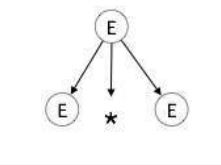
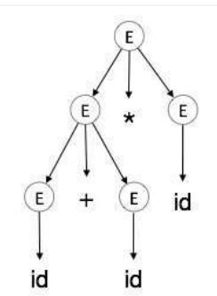

# <center> Syntax Analysis

# <center> 

When an input string (source code or a program in some language) is given to a compiler, the compiler processes it in several phases, starting from `lexical analysis` (As mentioned scans the input and divides it into tokens) to target code generation.


`Syntax analysis` or `parsing` constitutes the ***second*** phase within the compiler's workflow. This chapter delves into fundamental concepts crucial for constructing a parser.


## Syntax Analysis Aim and Scope
- Syntax analysis validates the syntax of the source code written
in a programming language using a component called parser.
- Testing for membership whether 𝑤 (a source code) belongs to
𝐿(𝐺) (a programming language with grammar G) is just a
“yes” or “no” answer.
- However the syntax analyzer in a compiler must
1. generate the syntax tree,
2. handle errors gracefully if string is not in the language.
### Syntax analysis goal
- The parser uses the stream of the tokens produced by the
lexical analyzer to create a tree-like intermediate
representation that depicts the grammatical structure of the
token stream.
- The parser reports any syntax errors in an intelligible fashion
and recovers from commonly occurring errors to continue
processing the remainder of the program.
### Syntax analysis prerequisites
- What we need for syntax analysis:
1. An expressive description technique: describe the syntax,
2. An acceptor mechanism: determine if input token stream
satisfies the syntax description.
- For lexical analysis:
1. Regular expressions describe tokens,
2. Finite Automata is acceptor for regular expressions.
- Why not use regular expressions (on tokens) to specify
programming language syntax?
#### Limitation of regular expressions for syntax analysis
- General-purpose programming languages like C, C++, C#, Java,
etc. are not regular languages, so they cannot be described
by regular expressions.
- Consider nested constructs (blocks, expressions, statements):
- $((a+b)^*(c-d)/e)$
- if (a>0) { if (a==b) {print(a);}}
- The sytnax of the ’{’ construct in the second code snippet can
be described with a language like 𝐿 =${︀𝑎^𝑛𝑏^𝑛|𝑛 ≥ 0}︀$ which is a context-free language not regular.
### Non-context-free language constructs
- Some constructs found in typical programming languages
cannot be specified using CFG grammars alone.
- Declaration of identifiers before their use:
𝐿1 =${︀𝑤𝑐𝑤|𝑤 ∈ (𝑎|𝑏)^*}︀$
- Checking that the number of formal parameters in the
declaration of a function agrees with the number of actual
parameters: 𝐿2 =${︀𝑎^𝑛𝑏^𝑚𝑐^𝑛𝑑^𝑚|𝑛 ≥ 1 ∧ 𝑚 ≥ 1}$
### Syntax analysis scope
- What syntax analysis cannot do:
1. To check whether variables are of types on which operations
are allowed,
2. To check whether a variable has been declared before use,
3. To check whether a variable has been initialized
- These issues will be handled in semantic analysis phase.
**example**
- Parsing only checks syntax correctness.
- Several important inspections are deferred until later phases.
- e.g. semantic analysis is responsible for type checking
- A program with the correct syntax (but incorrect semantics):
```cpp
int x = true; // type not agree
int y; // variable not initialized
x = (y < z); // variable not declared
```
## Context-free grammars
As previously explored, a `lexical analyzer` proficiently identifies tokens using regular expressions and pattern rules. However, its capacity is constrained when it comes to scrutinizing the syntax of a given sentence, particularly in tasks involving balancing tokens like parentheses. To overcome this limitation, `syntax analysis` employs `context-free grammar` **(CFG)**, a construct recognized by push-down automata.

`Syntax analysis`, often referred to as `parsing`, is a critical phase in compiler design where the compiler assesses whether the source code aligns with the grammatical rules of the programming language. Typically occurring as the second stage in the compilation process, following `lexical analysis`, the primary objective is to generate a parse tree or `abstract syntax tree` ***(AST)***. This hierarchical representation mirrors the grammatical structure of the program encapsulated in the source code.

### Programming languages grammar
- Context-free grammar (CFG) is used instead of regular
grammar (expressions) to precisely describe the syntactic
properties of the programming languages.
- A specification of the balanced-parenthesis language using
context-free grammar:
```
𝑆 → (𝑆)
𝑆 → 𝑆𝑆 | ε
```
- If a grammar accepts a string, there is a derivation of that
string using the rules of the grammar:
```
𝑆 ⇒ 𝑆𝑆 ⇒ (𝑆)𝑆 ⇒ ((𝑆))𝑆 ⇒ (())𝑆 ⇒ (())(𝑆) ⇒ (())()
```
### Context-free grammars for programming languages
A context-free grammar (CFG) is a type of grammar where every production rule is of the form `A → α`, where `A` is a single non-terminal and `α` is a string of terminals and/or non-terminals. 
**definition**
```
A grammar 𝐺 ={︀𝑉, 𝑇, 𝑆, 𝑃}︀   
is said to be context-free if all productions in 𝑃 have the form 𝐿𝐻𝑆 → 𝑅𝐻𝑆, where 𝐿𝐻𝑆 ∈ 𝑉 𝑎𝑛𝑑 𝑅𝐻𝑆 ∈$(︀𝑉 ∪ 𝑇)︀^*$  
𝑉 : A finite set 𝑉 of nonterminal symbols, that is disjoint with the strings formed from 𝐺, syntactic variables   
𝑇: A finite set of terminal symbols that is disjoint from 𝑉 , token or 𝜖 
𝑆: A distinguished symbol 𝑆 ∈ 𝑉 that is the start symbol, also
called the sentence symbol.
```
- Production rule specifies how non-terminals can be expanded.
- A derivation in 𝐺 starts from the starting symbol 𝑆.
- Each step replaces a non-terminal with one of its right hand
sides.
- Language L(G) of a grammar G:  
∙ The set of all strings of terminals derived from the start symbol.  
𝑆 → 𝑎𝑆𝑏 | 𝑆𝑆 | ε  
∙ 𝐿 ={︀𝑤 ∈ ${𝑎, 𝑏}^*$: 𝑛𝑎(𝑤) = 𝑛𝑏(𝑤) ∧ 𝑛𝑎(𝑣) ≥ 𝑛𝑏(𝑣), 𝑤ℎ𝑒𝑟𝑒 𝑣 𝑖𝑠 𝑎𝑛𝑦 𝑝𝑟𝑒𝑓 𝑖𝑥 𝑜𝑓 𝑤}︀.  

- Every regular grammar is context-free, so a regular language is
also a context-free one.

So, let's to Learn...


CFG, on the other hand, is a superset of Regular Grammar, as depicted below:


- Inductively build a production rule for each regular expression
operator:


- where
∙ 𝐺1 is grammar for 𝑅1 with the start symbol 𝑆1,
∙ 𝐺2 is grammar for 𝑅2 with the start symbol 𝑆2.

**example**
 Show that 𝐿 ={︀$𝑎^𝑛𝑏^𝑚$: 𝑛 ≠ 𝑚}︀ is a contex free language.  
 **solution**
 We want to construct a CFG for the language 𝐿=${𝑎^𝑛𝑏^𝑚∣𝑛≠𝑚}$
 We can split this into two disjoint CFLs:
 1. 𝐿=${𝑎^𝑛𝑏^𝑚∣𝑛>𝑚}$
 2. 𝐿=${𝑎^𝑛𝑏^𝑚∣𝑛<𝑚}$

 then L=L1 ∪ L2.
 Since context-free languages are closed under union, if both 
𝐿1 and 𝐿2 are CFLs, then so is L.


All productions are of the correct form 𝐴→𝛼, so this is a context-free grammar.

**Important Points**

Here are a few key points to remember about associativity:

- All operators with the same precedence have the same associativity. This is necessary because it helps the compiler decide the order of operations when an expression has two operators of the same precedence.
- The associativity of postfix and prefix operators is different. The associativity of postfix is left to right, while the associativity of prefix is right to left.
- The comma operator has the lowest precedence among all operators. It's important to use it carefully to avoid unexpected results.

#### Precedence

Precedence is like a rule that helps us decide which operation to perform first when two different operators share a common operand. For example, in the expression `2+3*4`, both addition and multiplication are operators that share the operand `3`. 

By setting precedence among operators, we can easily decide which operation to perform first. Mathematically, multiplication (*) has precedence over addition (+), so the expression `2+3*4` will always be interpreted as `(2 + (3 * 4))`.

#### Left Recursion

Left recursion is a situation where a grammar has a non-terminal that appears as the left-most symbol in its own derivation. This can cause problems for top-down parsers, which start parsing from the start symbol and can get stuck in an infinite loop when they encounter the same non-terminal in their derivation.

For example, consider the following grammar:

1. `A => Aα | β`
2. `S => Aα | β`
  `A => Sd`

The first example is an example of immediate left recursion, where `A` is any non-terminal symbol and `α` represents a string of non-terminals.
The second example is an example of indirect left recursion.


By understanding and managing precedence and left recursion, we can make sure that our compiler can correctly parse and evaluate expressions.
#### Understanding Associativity

Associativity is like a rule that helps us decide the order of operations when an operand has operators on both sides. If the operation is left-associative, the operand will be taken by the left operator. If it's right-associative, the right operator will take the operand. 

**Left Associative Operations**

Operations like Addition, Multiplication, Subtraction, and Division are left associative. This means that when an expression contains more than one of these operations, the operations are performed from left to right. 

For example, if we have an expression like `id op id op id`, it will be evaluated as `(id op id) op id`. To illustrate, consider the expression `(id + id) + id`.

**Right Associative Operations**

Operations like Exponentiation are right associative. This means that when an expression contains more than one of these operations, the operations are performed from right to left. 

For example, if we have an expression like `id op (id op id)`, it will be evaluated as `id op (id op id)`. To illustrate, consider the expression `id ^ (id ^ id)`.

## Parsing and Ambiguity
### Leftmost and rightmost derivations

In the world of compiler design, there are two types of derivations that we often encounter: left-most and right-most derivations. These are like the two sides of a coin, each with its own unique characteristics. 
- In a CFG grammar that is not linear, a derivation may involve
sentential forms with more than one variable.
- In such cases, we have a choice in the order in which
variables are replaced.  


**Example of Derivation (Parse) Trees**

Consider the following grammar and string:

- Grammar: `E → E + E | E * E | -E | (E) | id`
- String: `-(id + id)`

The leftmost derivation for this grammar and string is:

```
E ⇒ -E ⇒ -(E) ⇒ -(E + E) ⇒ -(id + E) ⇒ -(id + id)
```

The rightmost derivation for the same grammar and string is:

```
E ⇒ -E ⇒ -(E) ⇒ -(E + E) ⇒ -(E + id) ⇒ -(id + id)
```

Both derivations result in the same parse tree.
**Production Rules**

Let's start with some production rules. These are like the recipes that our compiler follows to understand and process the input string. Here are some example production rules:

```Algorithm
E → E + E
E → E * E
E → id 
```

And here's the input string that we'll be working with: `id + id * id`

**Left-most Derivation**

Now, let's see how the compiler would process this input string using a left-most derivation. This is like saying, "Hey compiler, let's start from the left and work our way to the right." Here's how it looks:

```Algorithm
E → E * E
E → E + E * E
E → id + E * E
E → id + id * E
E → id + id * id
```

Notice that the left-most non-terminal is always processed first. It's like the compiler is saying, "I'll handle the leftmost thing first, then move on to the next one on the left."

**Right-most Derivation**

Now, let's see how the compiler would process the same input string using a right-most derivation. This is like saying, "Hey compiler, let's start from the right and work our way to the left." Here's how it looks:

```Algorithm
E → E + E
E → E + E * E
E → E + E * id
E → E + id * id
E → id + id * id
```

And that's it! We've now explored both left-most and right-most derivations. Remember, these are just the two sides of a coin. Depending on the parsing strategy that the compiler uses, it might prefer one side over the other.


### Understanding Parse Trees

Parse trees are like a roadmap for your compiler. They are graphical representations of a derivation, showing how strings are derived from the start symbol. The start symbol becomes the root of the parse tree, and it's great to visualize this process.

A parse tree is a tree structure that represents the syntactic structure of a string according to some grammar. In the context of a CFG, a parse tree is a derivation or parse tree for `G` if and only if it has the following properties:

- The root is labeled `S`.
- Every leaf has a label from `T ∪ {ε}`.
- Every interior vertex (a vertex that is not a leaf) has a label from `V`.
- If a vertex has label `A ∈ V`, and its children are labeled (from left to right) `a1, a2, ..., an`, then `P` must contain a production of the form `A → a1a2...an`.
- A leaf labeled `ε` has no siblings, that is, a vertex with a child labeled `ε` can have no other children.

Let's take a look at an example using the left-most derivation of `a + b * c`.

**The Left-most Derivation**

For example for write parse tree for this left-most derivation:

```
E → E * E
E → E + E * E
E → id + E * E
E → id + id * E
E → id + id * id
```

**Step-by-Step Parse Tree Construction**

Now, let's build the parse tree step-by-step:


step 1: `E → E * E`




step 2: `E → E + E * E`


step 3: `E → id + E * E`


step 4: `E → id + id * E`


step 5: `E → id + id * id`



**Parse Tree Characteristics**

In a parse tree, we have:

- All leaf nodes are terminals.
- All interior nodes are non-terminals.
- In-order traversal gives the original input string.
- The parse tree shows the associativity and precedence of operators. The deepest sub-tree is traversed first, so the operator in that sub-tree gets precedence over the operator in the parent nodes.
- There is a many-to-one relationship between derivations
and parse trees.
- Indeed, no information on order of derivation steps is
associated with the final parse tree.
### Parse trees and abstract syntax tree (AST)
An AST does not include inessential punctuation and delimiters
(braces, semicolons, parentheses, etc.).


### Ambiguity in Grammar

A grammar is said to be ambiguous if it has more than one parse tree for at least one string.
- An ambiguous grammar is one that produces more than one
leftmost derivation or more than one rightmost derivation
for the same sentence.
- Note: One leftmost and one rightmost derivation for a word is
not sufficient.
**example**
 consider the following grammar:
```
𝐸 → 𝐸 + 𝐸 | 𝐸 * 𝐸 | − 𝐸 | (𝐸) | 𝑖𝑑 
```
**solution**
There is a word (string) id+id*id generated by this
grammar that has two different parse trees:


#### Ambiguity detection
The problem of deciding whether a given CFG is ambiguous is
undecidable.
- Bad news:  
∙ There is no general algorithm to remove ambiguity from a CFG.
- More bad new:  
∙ Some CFL’s have only ambiguous CFG’s.

CFL 𝐿 is inherently ambiguous if all grammars for 𝐿 are
ambiguous.  
**Inherent ambiguity: example**  
One possible ambiguous grammar for 
L ={︀$0^𝑖1^𝑗2^𝑘$: 𝑖 = 𝑗 ∨ 𝑗 = 𝑘}︀:
  
There are two derivations of every string with equal numbers
of 0’s, 1’s and 2’s:
```
𝑆 ⇒ 𝐴𝐵 ⇒ 01𝐵 ⇒ 012
𝑆 ⇒ 𝐶𝐷 ⇒ 0𝐷 ⇒ 012
```

**Notes on detecting ambiguous grammar**  
The following forms of CFGs are ambiguous:  
1. 𝐴 → 𝛼𝐴 | 𝐴𝛽 (left recursive and right recursive simultaneously)
2. 𝐴 → 𝐵, 𝐵 → 𝐶, 𝐶 → 𝑥, ..., 𝑥 → 𝐴
3. 𝐴 → 𝐴𝐴, 𝐴 → 𝐴𝐴𝐴, ...
4. 𝐴 → 𝐴𝛼𝐴
#### Ambiguity problems for compilers
- Ambiguity is problematic because meaning of the programs
can be incorrect.
- Example 1: Dangling-else problem
∙ Here "other"stands for any other statement.
 
- Consider statement:
∙ if 𝐸1 then if 𝐸2 then 𝑆1 else 𝑆2
 
- Results for 𝐸1 : false, 𝐸2 : true, 𝑆1 : 𝑧 := 10, and 𝑆2 : 𝑧 := 0  
∙ Top tree: 𝑧 does not set.  
∙ Bottom tree: 𝑧 = 0

#### Techniques for eliminating ambiguity
- There is no algorithm to convert automatically any ambiguous
grammar to an unambiguous grammar accepting the same
language.
Techniques for eliminating ambiguity from some CFGs:
1. Rewriting the grammar (cleanest way)  
. Sometimes an ambiguous grammar can be rewritten to
eliminate the ambiguity (a completely new grammar).
2. Applying disambiguating rules  
∙ On grammar,  
∙ At parsing time.
3. A combination of the above techniques

**example**

Unambiguous, with precedence and associativity rules honored:

- Ambiguous:  
E -> E + E | E * E | (E) | num | id

- Unambiguous:  
E -> E + T | T  
T -> T * F | F  
F -> (E) | num | id

For another example for operation(+, -, *, /, ^), we have:

E -> E + T | T

T -> T * F | T * F | F

F -> G ^ F | G

G -> num | id | (E)

                         E
                        /|\
                       / | \
                      /  |  \
                     E   +   T
                     |      /|\ 
                     |     / | \
                    num   T  *  F
                     |    |     |
                     1    F     G
                         /|\    |
                        G ^ F  num
                        |   |   | 
                       num  G   3
                        |   |
                        2  num
                            |
                            3


## Programming Languages Grammars
### Writing a grammar
- The sequences of tokens accepted by a parser form a
superset of the programming language.
- Subsequent phases of the compiler must analyze the output of
the parser to ensure compliance with rules that are not
checked by the parser.
### Lexical versus syntactic analysis
Why use regular expressions to define the lexical syntax of a
language?
1. Separating the syntactic structure of a language into lexical and
nonlexical parts provides a convenient way of modularizing the
front end of a compiler into two manageable-sized components.
2. The lexical rules of a language are frequently quite simple, and
to describe them we do not need a notation as powerful as
grammars.
3. Regular expressions generally provide a more concise and
easier-to-understand notation for tokens than grammars.
4. More efficient lexical analyzers can be constructed
automatically from regular expressions than from arbitrary
grammars.

- There are no firm guidelines as to what to put into the lexical
rules, as opposed to the syntactic rules.
- Regular expressions are most useful for describing the
structure of constructs such as identifiers, constants,
keywords, and white spaces.
- Grammars, on the other hand, are most useful for describing
nested structures such as balanced parentheses, matching
begin-end’s, corresponding if-then-else’s, and so on.

**A grammar for a subset of Java statements**
 

### ANTLR
 ANTLR (ANother Tool for Language Recognition) is a powerful parser generator used to build interpreters, compilers, and translators for domain-specific languages and structured text. It takes a grammar written in a special syntax and generates code—typically in Java, but also supporting languages like Python, C#, and JavaScript—that can recognize and process inputs according to that grammar. ANTLR supports lexical analysis (tokenizing) and syntactic analysis (parsing), allowing developers to define tokens, parser rules, and even error recovery strategies. Its output includes a lexer and parser that produce parse trees, which can be traversed using listeners or visitors to perform semantic analysis or code generation. ANTLR is widely used in academia and industry due to its flexibility, modern features, and strong tooling support.

#### Describing programming language grammar in ANTLR    
             

#### ANTLR input and output
 

## Parsing
- Process of determination whether a string can be generated by
a grammar.
- It is the process of determining how a string of terminals can
be generated by a grammar.
- A syntax analyzer or parser is a program that performs
syntax analysis.
- A parser takes as input tokens from the lexical analyzer and
treats the token names as terminal symbols of a context-free
grammar.
- The parse tree may be constructed figuratively (by going
through the corresponding derivation steps) or literally.
 

### Types of Parsing

Syntax analyzers follow production rules defined by means of context-free grammar. The way the production rules are implemented (derivation) divides parsing into two types : top-down parsing and bottom-up parsing.


#### Top-down Parsing(goal driven)

When the parser starts constructing the parse tree from the start symbol and then tries to transform the start symbol to the input, it is called top-down parsing.

- Start from the start non-terminal,
- Grow parse tree downwards to match the input word,
- Easier to understand and program manually.

> Recursive descent parsing : It is a common form of top-down parsing. It is called recursive as it uses recursive procedures to process the input. Recursive descent parsing suffers from backtracking.

> Backtracking : It means, if one derivation of a production fails, the syntax analyzer restarts the process using different rules of same production. This technique may process the input string more than once to determine the right production.

#### Bottom-up Parsing(data driven)

As the name suggests, bottom-up parsing starts with the input symbols and tries to construct the parse tree up to the start symbol.
- Start from the input word,
- Build up parse tree which has start non-terminal as root,
- More powerful and used by most parser generators.

**Example**:
Input string : a + b * c

Production rules:

```
S → E
E → E + T
E → E * T
E → T
T → id
```

Let us start bottom-up parsing
```
a + b * c
```

Read the input and check if any production matches with the input:

```
a + b * c
T + b * c
E + b * c
E + T * c
E * c
E * T
E
S
```
#### Directional methods
- Process the input symbol by symbol from Left-to-right,
- Advantage: parsing starts and makes progress before the last
symbol of the input is seen,
- Example: LL and LR parsers.
#### Non-directional methods
- Allow access to input in an arbitrary order,
- Disadvantage: Require the entire input to be in memory
before parsing can start,
- Advantage: Allow more flexible grammars than directional
parsers,
- Example: CYK parser

### Top-down vs. bottom-up
 
 

#### Parsing complexity
 