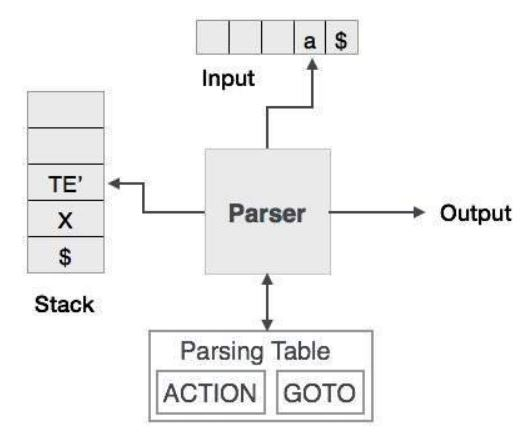

# Top Dawn Parsing


# <center> 
We have learnt in the last chapter that the top-down parsing technique parses the input, and starts constructing a parse tree from the root node gradually moving down to the leaf nodes. The types of top-down parsing are depicted below:

```
                             Top-Down
                                |
                        Recursive Descent
                        |               |
                  Back-tracking  Non back-tracking
                                        |
                                 Predictive Parser
                                        |
                                    LL Parser


```

## Recursive Descent Parsing


Recursive descent is a top-down parsing technique that constructs the parse tree from the top and the input is read from left to right. It uses procedures for every terminal and non-terminal entity. This parsing technique recursively parses the input to make a parse tree, which may or may not require back-tracking. But the grammar associated with it (if not left factored) cannot avoid back-tracking. A form of recursive-descent parsing that does not require any back-tracking is known as ***predictive parsing***.

This parsing technique is regarded recursive as it uses context-free grammar which is recursive in nature.
- A typical procedure for a nonterminal in a top-down parser is
as follows:
# 
This code represents a recursive descent parser for a top-down parsing approach, specifically implementing a procedure A() for a nonterminal symbol A. Here's how it works:
1. Choose a Production: The parser selects one production rule for nonterminal A, expressed as A → X₁X₂…Xₖ, where Xᵢ are symbols (terminals or nonterminals).
2. terate Over Symbols: For each symbol Xᵢ in the production (from 1 to k):
- If Xᵢ is a Nonterminal: The parser recursively calls the procedure for Xᵢ (e.g., Xᵢ()), allowing it to process the corresponding grammar rule.
- If Xᵢ is a Terminal and Matches Input: If Xᵢ matches the current input symbol a, the parser advances the input to the next symbol.
- Otherwise: If Xᵢ does not match the input (and is not a nonterminal), an error is reported.
3. Recursive Nature: The process repeats for each nonterminal encountered, building a parse tree from the top down by expanding nonterminals into their productions and matching terminals with the input.  

This method assumes a predictive parser with a single production choice per nonterminal for simplicity, and it fails if the input cannot be matched according to the chosen production. 

**problem:** The pseudocode does not specify how the parser selects which production rule for A (e.g., A → X₁X₂…Xₖ) to apply when there are multiple possible rules. Without a clear criterion or strategy (e.g., a parsing table or lookahead), the choice is arbitrary, making the parser nondeterministic. This can lead to different parse results for the same input, depending on the chosen production, which is undesirable for a reliable top-down parser.

**solution:** Use the lookahead symbol: the
first, i.e., leftmost, terminal of the input string.

**example:**
# 
# 
The match(terminal t) function is used in a top-down parser to verify and consume terminals from the input:

- It checks if the current lookahead symbol (lookahead) matches the expected terminal t.
- If they match, it advances the input by calling nextTerminal() to set lookahead to the next input symbol.
- If they do not match, it reports a "syntax error" and does not advance the input.

This function ensures the parser stays synchronized with the input stream, failing when the input deviates from the expected grammar.

## Back-tracking

### Back-tracking problem in general recursive-descent parsers
- General recursive-descent may require backtracking; that is,
it may require repeated scans over the input.  
∙ Backtracking: The selection of a production for a nonterminal
may involve trial-and-error; that is, we may have to try a
production and backtrack to try another production if the first
is found to be unsuitable.  
- A left-recursive grammar can cause a recursive-descent
parser, even one with backtracking, to go into an in
nite loop.  
∙ A → AX₁X₂…Xₖ;  
Top- down parsers start from the root node (start symbol) and match the input string against the production rules to replace them (if matched). To understand this, take the following example of CFG:
```
S → rXd | rZd
X → oa | ea
Z → ai
```
For an input string: read, a top-down parser, will behave like this:

It will start with `S` from the production rules and will match its yield to the left-most letter of the input, i.e. `r`. The very production of `S` `(S → rXd)` matches with it. So the `top-down` parser advances to the next input letter (i.e. `e`). The parser tries to expand non-terminal `X` and checks its production from the left `(X → oa)`. It does not match with the next input symbol. So the top-down parser backtracks to obtain the next production rule of `X`, `(X → ea)`.

Now the parser matches all the input letters in an ordered manner. The string is accepted.


## Predictive Parser


Predictive parser is a recursive descent parser, which has the capability to predict which production is to be used to replace the input string. The predictive parser does not suffer from backtracking.

To accomplish its tasks, the predictive parser uses a look-ahead pointer, which points to the next input symbols. To make the parser back-tracking free, the predictive parser puts some constraints on the grammar and accepts only a class of grammar known as LL(k) grammar.
- Predictive parsing relies on information about the first k
symbols that can be generated by a production body.
- Allow parser to "lookahead" k number of tokens from the
input.  
∙ LL(1): Parser can only look at current token.  
∙ LL(2): Parser can only look at current token and the token
follows it.  
∙ LL(k): Parser can look at k tokens from input.



Predictive parsing uses a stack and a parsing table to parse the input and generate a parse tree. Both the stack and the input contains an end symbol $ to denote that the stack is empty and the input is consumed. The parser refers to the parsing table to take any decision on the input and stack element combination.


In recursive descent parsing, the parser may have more than one production to choose from for a single instance of input, whereas in predictive parser, each step has at most one production to choose. There might be instances where there is no production matching the input string, making the parsing procedure to fail.

## LL Parser

An LL Parser accepts LL grammar. LL grammar is a subset of context-free grammar but with some restrictions to get the simplified version, in order to achieve easy implementation. LL grammar can be implemented by means of both algorithms namely, recursive-descent or table-driven.

LL parser is denoted as LL(k). The first L in LL(k) is parsing the input from left to right, the second L in LL(k) stands for left-most derivation and k itself represents the number of look aheads. Generally k = 1, so LL(k) may also be written as LL(1).


### First and Follow sets for a CFG
#### First set
**First set for string of grammar symbols α**. FIRST(α), where
α is any string of grammar symbols, to be the set of terminals, ′a,
that begin strings derived from α.  
**Computing First set**
- FIRST(α) ={︀a | α $⇒^*$ aβ}︀∪{︀ε | α $⇒^*$ ε}︀
- To compute FIRST(X) for all grammar symbols X, apply the
following rules until no more terminals or ϸ can be added to
any FIRST set:
1. If X is a terminal, then FIRST(X) ={︀}︀.
2. If X is a nonterminal and X → Y₁Y₂…Yₖ is a production for
some k ≥ 1 then place a in FIRST(X) if for some i, a is in
FIRST(Y<sub>i</sub>), and ε is in all of FIRST(Y₁), ..., FIRST(Y<sub>i-1</sub>).
3. If ε is in FIRST(Yj) for all j = 1, 2, ..., k, then add ε to
FIRST(X).
4. If Y₁ does not derive ε, then we add nothing more to
FIRST(X).
5. If X → ε is a production, then add ε to FIRST(X).

#### Follow set
**Follow set for nonterminal A in a CFG**. FOLLOW(A), for
nonterminal A, is the set of terminals a that can appear
immediately to the right of A in some sentential form.  
**Computing Follow set**
- FOLLOW(X) ={︀a | S$⇒^*$ βXaγ}︀
- To compute FOLLOW(X) for all nonterminals X, apply the
following rules until nothing can be added to any FOLLOW set:
1. Place \$ in FOLLOW(X), if X is the start symbol, and \$ is the
input right end marker (S′ → S\$).
2. If there is a production A → αXβ, then everything in
FIRST(β) except ε, is in FOLLOW(X).
3. If there is a production A → αX, or a production A → αXβ
where FIRST(β) contains ε, then everything in FOLLOW(A),
is in FOLLOW(X).


**example:**
Compute the First and Follow sets for non-terminals in the
following grammar:


**solution:**  
FIRST Sets  
The FIRST set of a nonterminal contains the set of terminals that can begin the string derived from that nonterminal.

$ FIRST(E) $:

$ E \rightarrow T E' $, so $ FIRST(E) = FIRST(T) $.  
$ T \rightarrow F T' $, so $ FIRST(T) = FIRST(F) $.  
$ F \rightarrow (E) \mid num $, so $ FIRST(F) = \{ (, num \} $.  
Thus, $ FIRST(T) = \{ (, num \} $, and $ FIRST(E) = \{ (, num \} $.  


$ FIRST(E') $:

$ E' \rightarrow + T E' \mid \epsilon $.  
$ + T E' $ starts with $ + $, so $ + $ is in $ FIRST(E') $.  
$ \epsilon $ is also a possibility, so $ FIRST(E') = \{ +, \epsilon \} $.  


$ FIRST(T) $:

As computed above, $ T \rightarrow F T' $, so $ FIRST(T) = FIRST(F) = \{ (, num \} $.


$ FIRST(T') $:

$ T' \rightarrow * F T' \mid \epsilon $.  
$ * F T' $ starts with $ * $, so $ * $ is in $ FIRST(T') $.  
$ \epsilon $ is also a possibility, so $ FIRST(T') = \{ *, \epsilon \} $.


$ FIRST(F) $:

$ F \rightarrow (E) \mid num $, so $ FIRST(F) = \{ (, num \} $.


FOLLOW Sets
The FOLLOW set of a nonterminal contains the set of terminals that can appear immediately after that nonterminal in a derivation.

$ FOLLOW(E) $:

$ E $ is the start symbol, so $ FOLLOW(E) $ includes $ \$ $ (end of input).  
$ E' \rightarrow + T E' $ can follow $ E $ in $ (E) $, so $ FOLLOW(E) = \{ ), \$ \} $.


$ FOLLOW(E') $:

$ E' $ appears in $ E \rightarrow T E' $, so $ FOLLOW(E') = FOLLOW(E) = \{ ), \$ \} $.  
Also, $ E' \rightarrow + T E' $ ends with $ E' $, reinforcing the same follow set.


$ FOLLOW(T) $:

$ T $ appears in $ E \rightarrow T E' $, so $ FOLLOW(T) = FOLLOW(E') = \{ ), \$ \} $.  
Additionally, $ E' \rightarrow + T E' $ places $ + $ before $ T $, so $ FOLLOW(T) = \{ ), +, \$ \} $.


$ FOLLOW(T') $:

$ T' $ appears in $ T \rightarrow F T' $, so $ FOLLOW(T') = FOLLOW(T) = \{ ), +, \$ \} $.


$ FOLLOW(F) $:

$ F $ appears in $ T \rightarrow F T' $, so $ FOLLOW(F) = FOLLOW(T') = \{ ), +, \$ \} $.  
Also, $ F \rightarrow (E) $ places $ ) $ after $ E $, which aligns with the follow set.


### LL(1) grammar
Predictive parsers, that is, recursive-descent parsers needing no backtracking,
can be constructed for a class of grammars called LL(1). The first "L" in LL(1)
stands for scanning the input from left to right, the second "L" for producinga leftmost derivation, and the "1" for using one input symbol of lookahead at
each step to make parsing action decisions  

**A grammar G is LL(1) if A → α | β are two distinct productions of G:**

> for no terminal, both α and β derive strings beginning with a.
>
> at most one of α and β can derive empty string.
>
> if β → t, then α does not derive any string beginning with a terminal in FOLLOW(A).
**definition**  
A grammar G is LL(1) if and only if whenever A → α | β are two
distinct productions of G, the following conditions hold:
1. FIRST(α) ∩ FIRST(β) = Φ
2. if α$⇒^*$ ε or β$⇒^*$ ε then FIRST(A) ∩ FOLLOW(A) = Φ


#### Predictive parsers implementations  
- Recursive: Recursive descent parser  
∙ Each non-terminal parsed by a procedure,  
∙ Call other procedures to parse sub-nonterminals recursively,  
∙ Automated by tools such as ANTLR.
- Non-recursive: Table-driven parser  
∙ Use the LL(1) parsing table,  
∙ Parsing table determines for each non-terminal and each  
look-ahead symbol what one production to use  
∙ Push-down automata: essentially a table driven FSA + stack to
do recursive calls,
#### LL(1) parsing table


If, after performing the above, there is no production at all in M[A; a], then set M[A; a] to error (which we normally represent by an empty entry in the table).

**example**


Consider production E → TE'. Since
FIRST(T E') = FIRST(T ) = {(, id}  
this production is added to M[E , (] and M[E , id].  
Production E' → +TE' is
added to M[E' , +] since FIRST(+TE') = {+}. Since FOLLOW(E') = {), \$}, production E' → ε is added to M[E' , )] and M[E' , \$].

**example**


### Table-driven predictive parsing
A nonrecursive predictive parser can be built by maintaining a stack explicitly, rather than implicitly via recursive calls. The parser mimics a leftmost derivation. If w is the input that has been matched so far, then the stack holds asequence of grammar symbols α such that  
S $⇒^*$ wα


This algorithm implements a predictive parsing using a parsing table $ M $ for a grammar $ G $ to determine if a string $ w $ is in the language $ L(G) $ and, if so, produces its leftmost derivation. Here's how it works:
1. Initialization:

- Start with the input string $ w $ and the parsing table $ M $.
- Let $ a $ be the first symbol of $ w $.
- Initialize the stack with the start symbol $ X $ (typically $ S $) and a marker $ \$ $.
2. Main Loop:

- Continue while the stack is not empty and the top symbol $ X $ is not $ \$ $.
- For each iteration:
    - Match Terminal: If $ X = a $ (the current input symbol), pop $ X $ from the stack and advance $ a $ to the next symbol of $ w $.
    - Terminal Mismatch: If $ X $ is a terminal but $ X \neq a $, report an error.
    - Nonterminal Processing: If $ X $ is a nonterminal, look up $ M[X, a] $ in the parsing table:
        - If $ M[X, a] $ is an error entry, report an error.
        - If $ M[X, a] = X \rightarrow Y_1 Y_2 \cdots Y_k $ (a production), perform the following:
            - Pop $ X $ from the stack.
            - Push the symbols $ Y_k, Y_{k-1}, \ldots, Y_1 $ onto the stack, with $ Y_1 $ on top.

- Update $ X $ to the new top stack symbol.
3. Termination:

- The loop ends when the stack is empty or $ X = \$ $.
- If $ w $ is fully parsed and the stack contains only $ \$ $, the algorithm outputs the leftmost derivation. Otherwise, it indicates an error.

**example:**  
grammer:

  
input:  
> id + id *id

table:
 
parsing:


Note that the sentential forms in this derivation correspond to the input that
has already been matched (in column MATCHED) followed by the stack contents.
The matched input is shown only to highlight the correspondence. For the same
reason, the top of the stack is to the left; when we consider bottom-up parsing,
it will be more natural to show the top of the stack to the right. The input
pointer points to the leftmost symbol of the string in the INPUT column.

## Transforming Grammars into LL(1)
### LL(1) grammars space


- Obviously, not all grammars can be converted into LL(1) form.
- Few transformation techniques can be applied to convert some
grammar into LL(1) form.

### Left factoring
- Left factoring is a grammar transformation that is useful for
producing a grammar suitable for predictive, or top-down,
parsing.
- if A →aα | aβ | γ , FIRST(aα) ∩ FIRST(aβ) ={︀a}︀
- then  
    A → aB | γ  
    B → α | β
- or (extended BNF form)  
    A → a(α|β) | γ
- Repeatedly apply this transformation until no two alternatives
for a nonterminal have a common prefix.

### Elimination of left recursion
- A grammar is left recursive if it has a nonterminal A such that
there is a derivation A $⇒^+$ Aα for some string α.
- Immediate left recursion:  
if A → Aα | β , FIRST(Aα) ∩ FIRST(β) ={︀β}︀
- then  
A → βB  
B → αB | ε
- or (extended BNF form)  
A → β{α}
- It does not eliminate left recursion involving derivations of two
or more steps.


This algorithm transforms a grammar $ G $ with no cycles or $\epsilon$-productions into an equivalent grammar without left recursion. It proceeds as follows:

1. Arrange Nonterminals: Order the nonterminals $ A_1, A_2, \ldots, A_n $ in a sequence, which determines the processing order.
2. Iterate Over Nonterminals: For each nonterminal $ A_i $ (from 1 to $ n $):
Substitute Earlier Productions: For each $ A_j $ (where $ j $ ranges from 1 to $ i-1 $):  
    - Identify all productions of the form $ A_i \rightarrow A_j \gamma $, where $\gamma$ is a string of symbols.  
    - Replace each such production with new productions $ A_i \rightarrow \delta_1 \gamma | \delta_2 \gamma | \cdots | \delta_k \gamma $, where $ \delta_1, \delta_2, \ldots, \delta_k $ are all existing productions of $ A_j $ (e.g., $ A_j \rightarrow \delta_1 | \delta_2 | \cdots | \delta_k $). This substitution eliminates indirect left recursion by expanding $ A_j $ into its alternatives.


3. Eliminate Immediate Left Recursion: After substitutions, check $ A_i $-productions for immediate left recursion (e.g., $ A_i \rightarrow A_i \alpha | \beta $). Transform them into:  
New nonterminal $ A_i' $.
Productions $ A_i \rightarrow \beta A_i' $ for all non-recursive productions $ A_i \rightarrow \beta $, and $ A_i' \rightarrow \alpha A_i' | \epsilon $ for all recursive productions $ A_i \rightarrow \alpha A_i' $.

It is possible to eliminate left recursion by transformation to right
recursion.


**example**   
Convert the following expression grammar to LL(1) form:
```
E → E + T | E − T | T
T → T * F | T/F | F
F → id | num | (E)
```
left factoring:
```
E → E(+T | − T) | T
T → T(*F | /F) | F
F → id | num | (E)
```
 left-recursion deletion:

 ```
 E → TT′
T′ → +TT′| − TT′| ε
T → FF′
F′ → *FF′| /FF′| ε
F → id | num | (E)
```
 Grammar in EBNF form:

 ```
 E → T{+T | − T}
T → F{*F | /F}
F → id | num | (E)
```
## Error Recovery in Predictive Parsing
### Predictive parsing errors
- An error is detected during predictive parsing when
    1. The terminal on top of the stack does not match the next input symbol,
    2. Or nonterminal A is on top of the stack, a is the next input
symbol, and M[A, a] is error (i.e., the parsing-table entry is
empty).
- Panic mode error recovery strategy: Skipping over symbols
on the input until a token in a selected set of synchronizing
tokens appears.
- Panic mode effectiveness depends on the choice of
synchronizing set.
### Synchronizing set
1. Place all symbols in FOLLOW(A) into the synchronizing set for
nonterminal A.
    - If we skip tokens until an element ofFOLLOW(A) is seen and
pop A from the stack, it is likely that parsing can continue.
2. Add keywords that begin statements to the synchronizing
sets for the nonterminals generating expressions.
3. If we add symbols in FIRST(A) to the synchronizing set for
nonterminal A, then it may be possible to resume parsing
according to A if a symbol in FIRST(A) appears in the input.
### Panic mode error recovery
grammer:

  
input:  
> +id * +id

table:
 

1. If the parser looks up entry M[A, a] and finds that it is
blank, then the input symbol a is skipped.
2. If the entry is "synch," then the nonterminal on top of
the stack is popped in an attempt to resume parsing.
3. If a token on top of the stack does not match the input
symbol, then we pop the token from the stack.

 
We need to modify the "match" procedure.
 
The updated match(terminal t, Set synch) function now includes a synch set for error recovery. If the lookahead does not match the expected terminal $ t $, it calls syntaxError(synch) instead of immediately failing. The syntaxError(Set stop) function reports a "Syntax Error" and skips input symbols by advancing lookahead with nextTerminal() until it encounters a symbol in the stop set, improving resilience against syntax errors.

### Phrase-level error recovery
- Phrase-level error recovery is implemented by filling in the
blank entries in the predictive parsing table with pointers to
error routines.
- These routines may change, insert, ordelete symbols on the
input and issue appropriate error messages.
