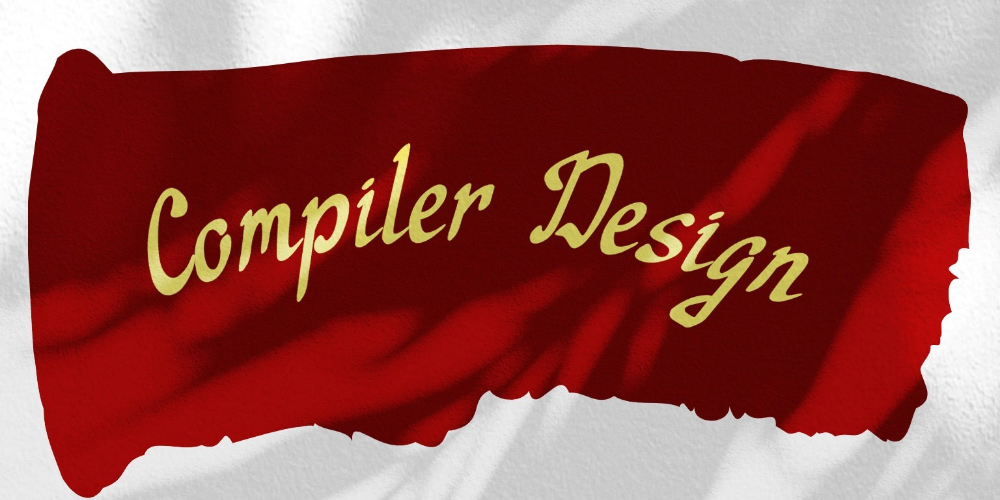

# 🎓 Compiler Design Course Pamphlets 📚

Welcome to our online pamphlets for the Compiler Design Course! 🎉

This repository contains a collection of pamphlets that I've created to help others understand some of the fundamental concepts in compiler design. I've taken the time to edit and rewrite these pamphlets in a more friendly and engaging way, making them easier to understand and more approachable to beginners. 📝

## 📖 Table of Contents

00. [Introduction](00_Introduction.md)

01. [Compiler Basic](01_Compiler-Basic.md)

02. [Lexical Analysis](02_Lexical-Analysis.md)

03. [Syntax Analysis](03_Syntax-Analysis.md)

04. [Top down](04_Top-down.md)

05. [Bottom up](05_Bottom-up.md)

06. [Translation Methods](06_Translation-Methods.md)

07. [Semantic Analysis](07_Semantic-Analysis.md)

08. [Intermediate-Code Generation](08_Intermediate-Code-Generation.md)

09. [Machine-Independent Optimizations](09_Machine-Independent-Optimizations.md)

10. [Run-time Environments and Code](10_Run-time-Environments-and-Code.md)

Embark on this educational journey, where you will not only gain theoretical knowledge but also acquire practical skills in building and understanding compilers. Let's explore the intricate world of compiler design together.

## 👩‍💻 Contributing

Your contributions are welcomed to these pamphlets! If you have any suggestions or improvements, please feel free to submit a pull request. I'm always looking for ways to improve these pamphlets and make them more helpful to others. 🙌
